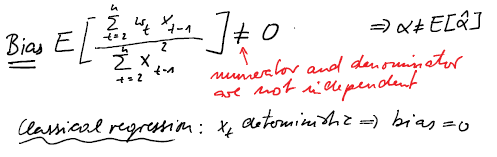
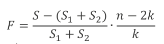
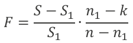
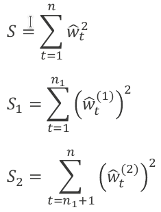
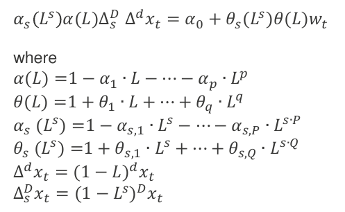
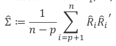

# Answering Old Exam Questions

## Recapping chapter 1+2

- *first exam 2018*: Decompose 
  + Two outputs in R, which formula corresponds with which output? (Decompose (x)) and decompose (x, type = “mult”)
  + Which output is better?
    + consider plot(decompose)
      + the seasonal and random component should be oscillating around zero for an additive model
      + the seasonal and random component should be oscillating around one for a multiplicative model 
- *Second exam 2018:* Holt-Winters Model explain components, give formula for xt and xt-hat (t+k), how is Maximum smoothing if the trend achieved?
  - components: level, trend, seasonality, residuals
  - formula for $x_t$ and $\hat x_{t+k|t}$ 
  - How is maximum smoothing for the trend achieved?
    - maximum smoothing = you basically do not consider this component!
    - you set $\beta = 0$ 

## Recapping chapter 3

- *Second exam 2018:* OLS estimator of AR(1) process is biased: what does that mean? 

  - Give  definition of bias. Prove it is biased (formula for OLS coefficient  given). 

    –> prove that the expectation of the bias term is unequal to zero

    - if this is the case $\alpha\neq E[\hat\alpha]$

    

  - Show that bias goes to 0 if n increases.

    - unclear, must be somewhere in the audio comments

- *first exam 2019*: ACF: Correlogram of Ts x and ts y, what meaning has dashed line, what  series is a random walk and which an AR(1) process, which properties can be observed from the correlogram of an AR(1) process, give these  properties for the given series

  - dashed line = 5 % significance level, autocorrelation value is not significantly different from zero, calculated using $1.96/\sqrt{n}$ 

    –> we reject the null hypothesis if we have more crossings than 5% of number of lags

  - What properties can be derived? 
    - autocorrelation
    - whether autocorrelation is time dependent or not
  
    –> whether there is significant autocorrelation in the residuals (= is there non-zero corealtion between the original time series and lagged versions of it?)

- *second exam 2019:* show which plot is rw and which one an ar. One looked a lot like white  noise but is the AR(1), the other one is the RW - identify

  - the random walk plot will look less stationary

  1. Do a 100 step ahead expected value and variance for the RW (given the sigma for the residuals)
     - expected value: $x_0$= first value of the time series
     - covariance = $t\sigma^2= 100\cdot \sigma^2$   

  

- ==*second exam 2018*:== differenced Series dx of x is an AR(1) process, Write r Code with lm to  fit dx. Values of x unknown. ; write R code to obtain x ; use lm to fit x

- ==*first exam 2019*:== Fill gaps in lm and bootstrapping code, derive mean and variance of  one-step-ahead forecast of an AR(1) model and write R code to calculate  it with series x and its fit

## Recapping chapter 4

- *second exam 2019:* Characteristic Polynomials
  1. what does weakly stationary mean

  2. find characteristic polynomial of the general AR(p)
     $$
     x_t = \alpha_0 +\alpha_1x_{t-1}+\dots+\alpha_px_{t-p}+ w_t\\
     \iff \alpha_0+w_t = (1-\alpha_1L-\alpha_2L^2-\dots-\alpha_pL^p)x_t\\
     \text{characteristic polynomial: } 1-\alpha_1z-\alpha_2z^2-\dots-\alpha_pz^p
     $$

  3. calculate the roots of 3 given AR(2) models by determining the characteristic polynomial first

     - find characteristic equation
     - solve it using abc formula $x = \frac{-b \pm \sqrt{b^2-4ac}}{2a}$

  4. look at the coefficients of 2 given Ar(4) and AR(5) models and say which one has a unit root

     - sum up the coefficients and see whether they equal to 1
- **one task will always be similar to homework 2, where outputs of `ur.df()` are given**
  
  - given: model selection tree and tables of test statistics
  - find the order of integration
  - Find the correct model coefficients
  - derive model equation until $x_t = \dots$
- *first exam 2019* Proof differenced AR(p) series xt has infinite lag order  if it is stationary -> Proof difference from the lecture
  
  - SEE MY PAPER NOTES ON DERIVATIONS
- breakpoint tests
  - *first exam 2018* Breakpoint Tests (forecasting)

    + what does it mean/do

      + it compares the residuals obtained from two different fits, one before, one after the breakpoint
      + null hypothesis: there is no breakpoint = the residuals are sufficiently similar

    + complete formula 

      + probably means the formula for the test statistic
      + for breakpoint variant: 
      + for forecast variant: 

    + write formulas for S (given w)

      + S = sum of squares of residuals of the fit for the entire time series

      

      
## Recapping chapter 5

*ARIMA, Seasonal ARIMA*

- *first exam 2018*: MA(q) Model 
  
  + Formula + expected value + derive variance
  
- *second exam 2019:* from AR(infinity) to MA(1) derivation. Without help, just write down the derivation.

  - refer to slide 1 of chapter 5
  - YouTube video: Invertibility $AR(\infty) \iff MA(1)$: [Link](https://www.youtube.com/watch?v=QU_VNu3rJKY) 

- *first exam 2019*: ARIMA(1,1,0)x(0,1,1): give formula and solve for xt without L, AR(p) can have cycles -> give example, Characteristics polynominal of AR(p)  tells what over cycle?

  

  

- *second exam 2018*: Seasonal ARIMA Model explain components of polynomial formula (L(...),  ...) ; how have orders to be chosen? How many restrictions does a  (0,0,1),(1,2,0) (or so) have?

  - unclear what is meant with the restrictions

  - probably: "How many parameters do you restrict to be = 0, because you use Seasonal ARIMA instead of "normal" ARIMA?"

    - e.g. for third example of the lecture (week 12):

    - highest lag = 25 + intercept

      –> 26 parameters

    - seasonal ARIMA has only 3 parameters: $\alpha_0, \alpha_{12,1}, \alpha_{12,2}$

      –> **We have 26-3 = 23 restrictions here!** 

## Recapping chapter 7

*VAR(p), VECM*

- *first exam 2018* : Vector time series with xt1 and xt2
  + what does gamma in matrix of sum of residuals mean?
  
  + Write down formula 
  
  + probably refers to the covariance matrix
    
  + then the solution would be:  
    
  + Is xt1 and/or xt2 stationary?
  
    + check whether the determinant of the reverse characteristic polynomial is equal to zero or not
    + if it is zero, the series are stationary
    + check: $\text{det}\left(I_{k}-A_{1} z-\cdots-A_{p} z^{p}\right)=0$ 
  
  + What is lag order of (p) for Integration Order 1?
  
    + unclear what is meant
  
    + we assume that $x_t$ is given with the information that it is an I(1) process
  
    + if the model equations are given, the lag order of $x_t$ would be 1 + the maximal lag order
  
    + e.g.
      $$
      \Delta(x_t = \alpha_0+\alpha_1x_{t-1})\\
      \Delta x_t = \alpha_0+\alpha_1\Delta x_{t-1})\\
      x_t-x_{t-1} = \alpha_0 + \alpha_1 (x_{t-1}-x_{t-2})\\
      $$
  
- *second exam 2019:* Given an R output for a VAR of 3x2 time series
  
  –> we have 3 VAR(2) time series
  
  1. find the amount of parameters (𝑘+𝑝∙𝑘^2 =𝑘 (1+𝑘𝑝))
  
     - $A_0+A_1 x_{t-1}+A_2 x_{t-2}+ R_t$
  
       - $A_0$ has dimension 3 x 1
       - $A_1,A_2$ have dimensions 3x3
  
       –> 3 +  3 *3 + 3 *3 = 21 coefficients
  
  2. there was an output and of var and you should have come up with the Var equation (there were some insignificant)
  
  3. code in R the expected value [R,R´] given residuals as resid
  
     ```R
     (t(resid)%*%resid)/(n-1)
     ```
  
  4. does x2t granger cause x1t and x3t? x2t had only insignificant model parameters, x2t and x3t had significant ones
  
     - check the coefficients of the matrix –> the parameters outside of the diagonal matrix are relevant for Granger causality!

- *first exam 2019:* Johansen-test: R command [ca.jo](http://ca.jo) and output test values and critical values r <= 2, r <= 1, r = 0… -> How many time series in z? Build VECM, what does rank tell about  cointegrating relations
  
  - 

