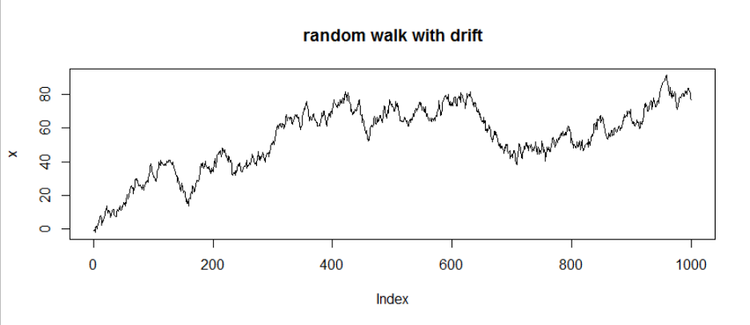

## Key Insights

- **How to differentiate additive model and multiplicative model with the plot of decompose function?**
  - the seasonal and random component should be oscillating around zero for an additive model
  - the seasonal and random component should be oscillating around one for a multiplicative model 


*Chapter 3*

- White Noise, Random Walk and AR(1) process in a nutshell 

  - **WN has no memory** -> no memory of its previous value at all! -> most jagged series 
  - **AR(1) process has short term memory** -> has moderate memory of its previous values at each next step 
  - **RW has long term memory** -> highly correlated to its previous value at each next step -> smoothest among the three processes 

- **Why is there a deterministic trend in a random walk with drift**? 

  - random walk with drift is basically a random walk on a slope -> corresponds to a deterministic trend, $\vartheta t$ 
  - "drift"here refers to a constant that each variable drifted away from its previous value at each step-> as this constant get "accumulated" for each step, it becomes a linear trend over time

- Random Walk vs. Random Walk with drift 
  
  - a constant drift in Random Walk lead to a linear trend over time, since this trend is deterministic -> same covariance, autocorrrelation  as Random Walk without drift but the expected value has an additional linear trend 
  
- **Why does differencing actually work to make a non-stationary time series stationary?**
  
  - insight from Chap 4 HW 3 (week 10): e.g.for a random walk, the absolute values are very different over time, but the **differences between subsequent values are not!**
  
  - see below, left: random walk, right: 1-times differenced, looks way more stationary
    
    
    
    => A stock price of a company over a time span of 3000 consecutive days (on the left) generally looks like a random walk but when we difference the series to look at the daily change for 3000 consecutive days (on the right), it should be a stationary process (stock price does not differ much from the one day before in general!)
  
- Effect on the variance of random variables when the variables are scaled by a factor, $a$ : since variance is in term of squared factor of the variables, the new variance = $a^2 \times$ old variance

  ```R
  w1 <- rnorm(100000, mean = 0, sd = 2)  
  var(w1) # 4 
  var(2*w1) # 2^2*4 = 16  
  var(0.5*w1) # 0.5^2*4 = 1
  w2 <- rnorm(100000, mean = 0, sd = 1)
  var(0.5*w1+2*w2) # 0.5^2*4 + 2^2+1 = 5
  ```

*Chapter 4*

+ **Why does a unit root cause problems in AR(p) processes?** -> From its asymptotic mean properties, we can see that the mean will be unbounded when there is a unit root ($\sum_{i=1}^p \alpha_i = 1$), hence making the process non stationary -> remove the unit roots by differencing to obtain stationary process 

+ **Integration order and Unit Root vs. lag order** 
  => no. of unit root = integration order $\neq$ lag order 
  => Given an AR(p) process, if the $\sum_{i=1}^p \alpha_i = 1$ (NOT including $\alpha_0$!) then we know there is a unit root process but it does not tell us how many unit roots -> solve the polynomial characteristic equation to find out, use `polyroot()`

+ **Covariance of random variables** -> When two random variables,($w_i$ & $w_j$) are independent and identiacally distributed (i.i.d), independent means there is no correlation when $i \neq j$; when $i = j$ -> $cov[w_i, w_i] = cov[w_j,w_j]$ (covariance of the random variable with itself = variance of the random variable), if $w_i, w_j$ ~ $N(0, \sigma^2)$ -> $cov[w_i, w_i] = cov[w_j,w_j] = var[w_i] = var[w_j] = \sigma^2$ (when $i =j$) 

+ **What are the causes of non-stationary in a process?** -> seasonal effect, trend or serially correlated variance (heteroskedasticity)

+ **Why we use the formula of AR(p) model in integrated of order for prediction?** What this $x_{t}=x_{0}+\sum_{i=1}^{t} \Delta x_{i}$ tells us? 

  => in an imaginary mask shortage outbreak, let says $x_t$ is the mask price of point in time $t=4$, we can estimate the price if we know the past consecutive daily price increment and the starting price -> starting price = 1, so $x_4 = 1+2+3+1 =7$ (CAUTION: assuming the price increase linearly so we do first differencing to get daily difference (a stationary process) in order to do the prediction)

  

*Chapter 5*

*Chapter 7*

## Summary

### Why are time series interesting to analyze?


- data = measurements of one or more variables over time, data points have a regular interval, e.g. daily, monthly, quarterly

- if the model is good enough to approximate the ground truth in data, you can make forecasts that will be approximately true

  –> leverage this in business/science/policy scenarios!

- **general assumption: observations from the past can be extrapolated to be used for predictions of the future!**  


### Ergodicity

+ A process is considered ergodic when its statistic properties can be derived from a single and long realization (time series observations) of the hypothetical model 
  + statistic properties: sample moments (mean, variance, skewness & kurtosis)
  + For a single realization, if we manage to stationarize it we'll obtain ergodicity
+ In social science simulation, we always need to assume ergodicity because e.g. real life event can only occur once and we only get a single realization of the process   
+ Egordicity is a sub-class of stationary 
  + All ergodic process must be stationary but not all stationary process are ergodic 
  + a time series with linear trend is not stationary and hence it is not ergodic 
+ **In all our analysis we need to assume ergodicity, because otherwise we can't derive anything meningful from a single observation with our statistical tools!**
+ Example of an ergodic process: Throwing coins -> we get the same statistic properties of the process when we throw 1000 different coins in one experiment vs. when we throw a single coin repeatedly for 1000 times 
+ Example of a non-ergodic process: Finding the most visited place -> observing the places visited by 1000 different people in a day vs. observing the places a person visited in 1000 days (We'll get different statistic properties!) 

### Decomposition 

+ as a tool to understanding a time series
  + find out the possible cause of variation 
  + figure out the structure of a time seris 
  + prelimary step before selecting/applying a forecasting method 
  
+ $n_t$: level (= the underlying value of a time series **not considering any fluctuations**) 

  $s_t$: seasonal (= fluctuations that occur in a fixed period)

  $r_t$: residuals (= what is not explained by the other components; should have constant variance over time –> homoskedasticity) 

- **other possible components**
  
  - trend (= steady in/decrease of the level)
  - cycle (= fluctuations that are more irregular than seasonality, period length might be unknown)
  
+ use `decompose()` function to analyze all the components (trend, seasonal and random)
  
  + we compare the fit of either the `additive` or `multiplicative` type by analyzing the random component (should look random without any trend and with the same variance over time)
  


#### Additive Model

+ $n_t + s_t + r_t$; mean of $s_t$ and $r_t$ should be 0 (so that the level is overall not influenced)

    ```R
  plot(decompose(x, type = "additive"))
  ```

#### Multiplicative Model

+ $n_t \cdot s_t \cdot r_t$; mean of $s_t$ and $r_t$ should be 1 (so that the level is overall not influenced)

    ```R
  plot(decompose(x, type = "multiplicative"))
  ```

+ use it when **seasonal effects tends to increase as the trend increases** 

+ if the random variables is modelled by a multiplicative factor & the variable is positive 
  
  + use $\log$ to transform to additive decomposition


#### Alternative Multiplicative 

+ $n_t \cdot s_t + r_t$; mean of $s_t$ should be 1 and mean of $r_t$ should be 0 

### Mathematical Transformations

- **intuition: Why do you transform a time series?**
  - **ultimate goal of modeling:** find a simple model that fits the data, because simpler models = better forecasts
  - different types of transformation can **remove different unwanted properties in the data**

#### Logarithmic

+ transforms a multiplicative model to an additive model
  
  + $x_t = n_t \cdot s_t \cdot e_t \Rightarrow y_t = ln(x_t) = ln(n_t) + ln(s_t) + ln(e_t)$  


+ **use case:** if the time series shows exponential growth, it is better to fit log(time series) as a model, as the time series will be more linear!
  
  = the transformation will make logarithmic behaviour look linearly!
  
+ A well-known example in economics: log return 
  
  + Return is defined as, $R_t = \frac{P_t - P_{t-1}}{P_{t-1}} = \frac{P_t}{P_{t-1}}-1$
  + Gross return is $R_t + 1 = \frac{P_t}{P_{t-1}}$ 
  + log return = log of gross return, $r_t = ln(R_t + 1) = ln(\frac{P_t}{P_{t-1}})=ln(P_t) - ln(P_{t-1})$
    + benefits of using log return: 
      1. if $ln(P_t)$ is a random walk then $\Delta ln(P_t)$ will be stationary (Chap 4 HW 3.R - Apple Stock price) 
      2. log return has nice properties: breakdown the multiplicative model of gross return in $k$ periods into additive model: $[R_t+1]_k = \frac{P_t}{P_{t-1}}\cdot\frac{P_{t-1}}{P_{t-2}}\cdot\frac{P_{t-2}}{P_{t-3}}\dots \frac{P_{t-k+1}}{P_{t-k}} \Rightarrow ln(\frac{P_t}{P_{t-1}}\cdot\frac{P_{t-1}}{P_{t-2}}\cdot\frac{P_{t-2}}{P_{t-3}}\dots \frac{P_{t-k+1}}{P_{t-k}})$
         $\Rightarrow ln((R_t +1)\cdot (R_{t-1}+1)\dots (R_{t-k+1}+1)) = ln(R_t +1) +  ln(R_{t-1}+1)+ \dots + ln(R_{t-k+1}+1)$ 
         $\Rightarrow r_t + r_{t-1} + \dots + r_{t-k+1}$ (summation of log return in $k$ periods = multiplicative of gross return in $k$ periods)  
      3. if returns are independent, then log returns are independent -> uncorrelatedness can be checked with `acf()` and variance of the additive model can be calculated easily:  $var([r_t]_k) = var(r_t) + var(r_{t-1})+ \dots + var(r_{t-k+1})$ but the variance of multiplicative model of gross return is NOT simply $var([R_t+1]_k) = var(R_t+1) \cdot var(R_{t-1}+1) \dots var(R_{t-k+1}+1)$


+ When we apply log transformation, the expectation & variance of the transformed value is not the function of the expectation & variance of the untransformed value! -> due to Jenson's inequality 
  
  –> **doing the logarithmic transformation changes the distribution of the data points!**
  
  + let $x_t := ln(r_t)$ ~ $N(0, \sigma^2)$ , the transformed value, $r_t = exp(x_t)$ `x = rnorm(1000, sd=2)`, ` r = exp(x)` 
  + `mean(r)` $\neq$ `exp(mean(x))` and `var(r)^0.5` $\neq$ `exp(var(x))^0.5` 
    + the correct formula is `mean(r)` = `exp(var(x)/2)` and `var(r)^0.5` = `(exp(var(x))*(exp(var(x))-1))^0.5`
    + $\mathbb{E}[r_t] = \mathbb{E}[exp(x_t)] \neq exp(\mathbb{E}[x_t]) = 1$ but $\mathbb{E[r_t]} = exp(\sigma^2/2)$
      + Jensen's inequality theorem says for all convex function,$f$ $\Rightarrow \mathbb{E[f(x)]} \ge f(\mathbb{E}[x])$
      + since exponential function is a convex function, $\mathbb{E}[r_t]$ must be larger than 1 
  
  
  
  + when a normally distributed variables undergo a tranformation with function that is convex, its distribution becomes right skewed (with fat right tail) as the convex function stretches the distribition of $r_t$ as $x_t$ increases -> recall how exponential function looks like (y value increases drastically as x value increase in small scale) 		

#### Box-Cox 

+ $$x_t = B(y_t, \lambda)=\left\{\begin{array}{ll} ln \left(y_{t}\right) & \text { if } \lambda=0 \\ \left(y_{t}^{\lambda}-1\right) / \lambda & \text { otherwise } \end{array}\right.$$

  + logarithmic + power transformation
    + the parameter **$\lambda$ determines the type of transformation**
    + for $\lambda = 1, y_t$ will not be transformed
    + $\lambda$ is a hyperparameter that needs to be estimated

+ to fix the non-normality of the residuals (remove heteroskedasticity/skewness in the residuals)
  + to make the pattern across the data more consistent -> more accurate forecast with data in normality 
  + address limitation of logarithmatic transformation: $y_t$ has to be positive 
  
+ from this:  to this: 

  –> if all the peaks have the same height, the data is "simpler"

+ **Caution:** OLS can not be used to estimate $\lambda$!

  + $\text{Given: } y_t > 1, \lambda \rightarrow-\infty\Rightarrow y_t \rightarrow 1, B(y_t, \lambda) \rightarrow 0 \forall t$ 

    –> the sum of squared error will be = zero!

    –> the suggested transformation **would transform the time series to a horizontal line that goes through the origin!**

  + instead, the profile likelihood is used

### Exponential Smoothing

- **intuition:** the smoothing effect results from using past observations to calculate the smoothed version of the current one
- best for data without clear trend/seasonality
- model without considering trend and seasonality, just model the current level using the past level value with the smoothing parameter, $\alpha \in (0,1)$ 
  -  if $\alpha\approx 1$, you give a lot of weight to the most recent observation
    - decreases exponentially as obs. go further in the past 
  - $n_0 = x_1$; $n_1 = \alpha x_1 + (1 - \alpha) n_0$  ->  derive the $k$-step ahead forecast equation [03_02_ExponentialSmoothing.pdf]
- can be seen as a simplification of Holt-Winters

### Holt-Winters Model

- to capture seasonality by smoothing with the consideration of trend and season of period 

- contains three components: level, trend, season

  –> one smoothing parameter for each of the components, $\alpha, \beta, \gamma$ 
  
  + get maximal smoothing when the smoothing parameter = 1; minimal smoothing when they are = 0

+ use additive method when -> seasonal variations are constant through the series 
  + seasonally adjust the level by subtracting the seasonal component (of last period) 
  + forecast formula: adding the seasonal part 
+ use multiplicative method when -> seasonal variations are changing **in propotion to the level of the series**
  + seasonally adjust the level by dividing the seasonal component (of last period) 
  + forecast formula: multiplying the seasonal part  
  –> one smoothing parameter for each of the components, $\alpha, \beta, \gamma \in [0,1]$  

  - if = 0 the respective component will be maximally, if = 1 it will be minimally smoothed

  

+ use additive method when -> seasonal variations are constant through the series 

+ use multiplicative method when -> seasonal variations are changing **in proportion to the level of the series**

### White Noise

- white noise = the simplest stochastic model

  –> **it is not a proper model, but what the residuals/randomness in a model should look like!**

- a time series is called white noise if **its data points are i.i.d. distributed with mean = 0**

- **model equation:** $w_t \sim \mathcal{N}(0,\sigma^2)$ 

- **properties**

  - **expected value** $\mu= E[w_t]=0$ is calculated as $m_n= \frac{1}{n}\sum_{t=1}^n w_t$ 

    –> theoretically, mean = average should be zero!

  - **autocovariance** $\gamma_k = Cov[w_t,w_{t+k}]= \left\{\begin{array}{ll} \sigma^2 & \text { for } k=0\\ 0 & \text { for }  k\neq0\end{array}\right.$ is calculated as $c_{k,n}= \frac{1}{n}\sum_{t=1}^{n-k}(w_t-m_n)(w_{t+k}-m_n)$ 

    –> theoretically, there should be no autocovariance between different white noise data points = statistically independent!

  - **autocorrelation** $\rho_k = Cor[w_t,w_{t+k}]= \frac{\gamma_k}{\sigma^2}= \left\{\begin{array}{ll} 1 & \text { for } k=0\\ 0 & \text { for }  k\neq0\end{array}\right.$ is calculated as $r_{k,n}= \frac{c_{k,n}}{c_{0,n}}$  

    –> there should be no autocorrelation in the time series!
    
    + use the autocorrelation plot obtained with `acf()`

- in practice, the mean is usually never == 0, so you **test whether the mean is significantly different from zero using the covariance!** 


#### Code Snippets

- **How to create white noise**: `w <- rnorm(n, sd = 20)`
  - we create it sampling from a normal distribution with mean zero
  - parameters to specify: standard deviation `sd`, number of samples `n`
- **How to check whether there is randomness in autocorrelation**:  
  - `acf()` calculates the correlation between the time series and a lagged version of itself!
  - y-axis = ACF, x-axis = lag (–> How many steps was the time series shifted?)
  - **at lag 0, ACF = 1 (this is always the case, because by definition $c_{0,n}/c_{0,n} =1$)**; **at other lags, ACF = 0 **
    - in reality, ACF at other lags would not be exactly = 0 but close enough to zero 
    - how to conclude this null hypothesis? -> hypothesis testing with significant level of 5% (the dashed line) 
      - How would you calculate it? -> It shows the allowed bound of our null hypothesis! - it's $1.96/\sqrt{n} $!
    - if we have a plot with lag=40, considering 5% significant level, then only at 40*0.05 = 2 lags should cross this dashed line
- **How to check whether the mean is significantly different from zero:**
  - if $1.96 \times \sigma/\sqrt{n}$ is larger than the mean of the series 
  - `1.96*sd(w)/n^0.5 > mean(w)`
- **How to calculate the variance of the white noise series?**
  - `cov(w,w)`
  - `1/(n-1)*t(w-mean(w))%*%(w-mean(w))`
  - `n/(n-1)*acf(w, type="covariance", plot=FALSE)$acf[1]`

### Random Walk

- example for a **non-stationary, non-ergodic** model, due to its properties!

- **random walk of order 1**: $x_t = x_{t-1}+w_t$ 

  –> **intuition:** "the value of tomorrow is equal to the value of today + a random value"

  + it is the **accumulation of random deviations from prev steps** until the current time
      + `for (t in 2:1000) x[t] <- x[t-1]+w[t]`
      + generalized eqn: $x_t = x_0 + \sum_{i=1}^tw_i$ 

  = **long-memory process** -> $x_t$ consists of sum of all noises of the prev periods so each noise has a lasting impact on the process  

- **properties**

  - **expected value** $\mu= E[x_t]=E[x_0+\sum_{i=1}^tw_i]= x_0$

    –> the expected value is equal to the first value of the time series

  - **autocovariance** $\gamma_k = Cov[x_t,x_{t+k}] = \sum_{i=j}Cov[w_i,w_j]=t\sigma^2$

    –> the covariance is time dependent and thus becomes infinitely large for $t \rightarrow \infty$  

    

  - **autocorrelation** $\gamma_k = Cor[x_t,x_{t+k}] = \frac{1}{\sqrt{1+k/t}}$ 

    –> for large t ($t \rightarrow \infty$ ), the denominator is $\approx 0$ and autocorrelation approaches 1, **so values of a time series heavily depend on previous ones!** 
    
    => in another word, $x_t$ and $x_{t+l}$ are strongly correlated even if they are far apart in time -> result in a lasting trend which is stochastic! Why stochastic? (from the sum of all past noises!)

- **random walk with drift:** $x_t = \vartheta+x_{t-1}+w_t$

  - rephrased to: $x_t = x_0+\vartheta t+\sum_{i=1}^t w_i$ 
  - the drift implies that the value of the time series is constantly in/decreasing over time
  - **only difference in property:** **expected value** $\mu= E[x_t]= x_0+\vartheta t$

- the **difference operator**  makes a random walk stationary!

  - **Differencing Operator** 
    + Differencing turns out to be a useful operating that can transform a non-stationary ts (e.g. random walk) to a stationary ts (e.g. white noise)
    + the difference operator is defined by: $\nabla x_t = x_t-x_{t-1}$; rewrite as $\nabla x_t=(1-\textbf{B})x_t$
      + in general term: $\nabla^n = (1-\textbf{B})^n$
    + the first-order differences of a random walk are white noise series, so we can check the acf of the differece operation -> `acf(diff(x))`

#### Comparison of random walk and random walk with drift 


+ the drift term introduce a deterministic trend, $\vartheta$ in the expected value in random walk with drift model -> so we observe a random walk with a slope! 
  + both random walk with/without drift have autocovariance that depends on time, $t\sigma^2$ -> as time increases, deviates more from the mean (dashed line in the graph)  
+ The **variance of the random walk with/without drift increases without bound** as it increases as $t$ increases -> so only suitable for short term predictions
+ autocovariance function of a random walk with/without drift **depends on the particular time values, $t$ and $t+k$,** but **not on the lag** -> weakly stationarity 
+ The deterministic part of the model will dominate the stochastic component (come from the white noise) over the long run because the deterministic trend, $\vartheta$  is proportional to $t$; the stochastic trend depends only on the $\sigma$ which is in proportion to the $\sqrt{t}$

#### Code Snippets

- **How to generate a random walk**

  ```R
  # random walk with lag 1 without intercept
  for (t in 2:1000) x[t] <- x[t-1]+w[t]
  ```

- **How to identify a random walk using `acf()`**
  
  - the autocorrelations will be very high for all lags!
  
    –> **this is the same for a random walk with drift!**
  
    
    
    + `acf(x)` -> use with caution because random walk is not ergodic, meaning it's not stationary in mean and in the variance; random walk violate the stationarity in the variance
    
    + for large values of k, we slowly approach 0
    
      –> look at formula for autocorrelation
    
    + for large $t$ with $k$ considerably less than $t$, we have $p_k$ is nearly 1 -> we have a positive autocorrelation that decay very slown down from unity -> check definition of autocorrelation above 

### AR(1)

- simplest auto-regressive model

- **model equation** $x_t=\alpha_0+\alpha_1 x_{t-1}+w_t$

  - $|\alpha_1|<1$: auto-regressive process
  - $\alpha_1 = 1$ : random walk with drift
  - $\alpha_0 = 0$ & $\alpha_1 = 1$: random walk
  - $\alpha_1>1$: explosive process

- **properties**

  - **mean** $\mu(t)= E[x_t]= \alpha_0\cdot \frac{1-\alpha_1^t}{1-\alpha_1}+\alpha_1^t\cdot x_0 \xrightarrow{t\rightarrow\infty} \frac{\alpha_0}{1-\alpha_1}$  

  - **autocovariance** $\gamma_k(t) \xrightarrow{t\rightarrow\infty} \frac{\alpha^k\cdot \sigma^2}{1-\alpha_1^2}$ (use geometric series to expand the summation in order to derive this!)

  - **autocorrelation** $\rho_k(t)= \frac{\gamma_k(t)}{\gamma_0(t)}= \alpha_1^k$  -> **autocorrelation decays to zero more rapidly for small $\alpha_1$**  

    with $\gamma_0(t) \rightarrow \frac{\sigma^2}{1-\alpha_1}$ 

  –> time series are (only) asymptotically stationary, because its properties have no dependence on t!

#### AR(1) without constant term

- **properties**

  - **mean** $\mu(t)= E[x_t]= \alpha^t\cdot x_0 \xrightarrow{t\rightarrow\infty} 0$ 

    –> mean will go to zero for large values of t

#### Comparison to random walk model 

+ As compared to random walk with drift, we have a $\alpha$ coefficient for the past value, $x_{t-1}$; we don't have a long memory process, so there is no smooth upward & down trend now 
+ Random walk is smoother than AR(1), which is smoother than white noise model; Autocorrelation of AR(1) decays quicker than the random walk -> AR(1) process has a closer resemblence to the white noise model than the random walk process 


- **compare white noise, random walk (with drift) and AR(1) by eyeballing**


–> **the interval of values is quite large **for random walk with drift -> its variance is unbounded when $t \rightarrow \infty$ 




#### Parameter Estimation of $\alpha$ (ML, OLS) 

- use ordinary least squares (OLS)

  - minimize the sum of squared errors
  - $SSE = \sum_t(x_t-(\alpha_0+\alpha_1\cdot x_{t-1}))^2$
  - find parameters such that $\frac{\part}{\part\alpha_1}SSE=0$
  - **translates to:** "minimize the squared sum of the difference between the data points and an AR(1) model"

  $$
  \begin{align}
  \frac{\part}{\part\alpha}SSE=0\\
  \frac{\part}{\part\alpha}\sum_{t=1}^{n-1}(x_{t+1}-\alpha x_t)^2 = 0\\
  -2\sum_t (x_{t+1}-\alpha x_t) x_t=0\\
  \dots \\
  \alpha = \frac{\sum_{t=2}^nx_t\cdot x_{t-1}}{\sum_{t=1}^{n-1}x_t^2}\\
  \text{substitute } x_t = \alpha x_{t-1}+w_t \text{ to get:}\\
  \hat\alpha = \alpha + \text{bias term}
  \end{align}
  $$

  

  - **there will be a bias $\neq 0$ in the parameter estimate!** 

    –> $\alpha \neq E[\hat\alpha]$ 

- use maximum likelihood (ML)

  - "Maximize the log-densitiy of the joint Gaussian density "

#### Code snippets

- **How to generate an AR(1) process without intercept**

  ```R
  for (t in 2:1000) x[t] <- 0.7*x[t-1]+w[t]
  ```

  - it is an AR(1) process and no random walk because $\alpha = 0.7\neq1$ 

### AR(p) model

+ **Key idea: current values of the series, $x_t$ can be explained as a function of $p$ past values**, $x_{t-1}, x_{t-2}, ..., x_{t-p}$ where $p$ determines the number of time step we need to step into the past in order for us to forecast the current value! 

+ Model eqn: $x_t = \alpha_0 + \alpha_{t-1} +...+ \alpha_px_{t-p} + w_t$
    + with the lag operator, rewrite to: $(1- \alpha_1L - ...-\alpha_pL^p) x_t = \alpha_0 + w_t$ 
    + $L \cdot x_t = x_{t-1}$
    + $L^nx_t = x_{t-n}$
    
+ Asymptotic mean of AR(p) process: let's assume that the expected value of each variable in the AR(p) process equals to $\mu$

    $\Rightarrow \mu = \frac{\alpha_0}{1-\alpha_1 - \dots - \alpha_p}$

    => if we have a unit root, where sum of $\alpha$s = 1, the mean will be either $-\infty$ (if $\alpha_0$ is negative) or $\infty$ (if $\alpha_0 is positive) 

### Bootstrapping

- bootstrapping is **useful when you don't know the distribution of the residuals** 
- you do sampling with replacement
- **intuition:** you approximate the unknown distribution you sample from by taking many samples from which you can **calculate mean + standard deviation**
- in our case, we apply bootstrapping to sample from residuals in order to calculate k-step ahead forecasts

#### Code Snippets

- **How to do bootstrapping with `boot()`**

- **How to do bootstrapping with `sample()`**

- **How to do bias-corrected bootstrapping**

  - bias correction is important for **small samples, because the bias term will be $\neq 0$** (refer to Chapter *Parameter Estimation of $\alpha$ (ML, OLS)* ) 
  - implements approach from a paper: Kim et al. (2010): Bias-Corrected Bootstrap Prediction Intervals for Autoregressive Model: New Alternatives with Applications to Tourism Forecasting, Journal of Forecasting 29(7):655 - 672

  ```R
  # from Chap 4 Bootstrap.R
  ```

  

### Stationarity

- formal definitions of the types of stationarity we encounter
- **"A time series is…"**
  - **(weakly) stationary**
    - "… if mean + variance of a time series are constant (can be large, but $<\infty$)." 
    - this is the most often used notion of stationarity
    - for an AR(p) time series, if all complex roots of the characteristic polynomial $1 - \alpha_1z \dots-\alpha_p \cdot z^p$ are outside the unit circle {$z \in \mathbb{C} | |z| = 1$} 
  - **trend-stationary**
    - "… if the time series is stationaryafter a constant, deterministic trend term $\beta t$ is subtracted."
  - **difference-stationary**
    - "…if the one-times differenced time series $\Delta x_t$ is stationary."
  - **strictly stationary**
    - "…if the distribution of data points across all lagged versions  $x_{t+k}$ are identical to $x_t$." 
  - we never use this
  
- **differencing a time series means using the difference operator like this: **

  

### Augmented Dickey-Fuller test/ Unit roots Test (= testing for Stationarity)

- **we test for stationarity using an alternative form of the AR(1)/AR(p) model equation**
  - by rearranging we achieve: $\Delta x_t = \alpha_0+ \delta x_{t-1}+w_t$ (AR(1))

  - or $\Delta x_t = \alpha_0+\delta x_{t-1}+\sum_{i=1}^{p-1}\tilde\alpha_i\Delta x_{t-1} +w_t$ AR(p), respectively

    where  $\delta = \alpha_1+\dots+\alpha_p-1$ 

- **intuition: Do the model coefficients $\alpha_i, \alpha_0, \delta$ take on specific values (= Are their values restricted, e.g. equal to zero or one)?**

- **the existence of unit roots mean that the process is non-stationary!**
  
  - unit roots = restriction on the model coefficients $\alpha$
  
  - for AR(1) –> $\alpha_1=1\iff \delta = 0$

    - the process will be stationary, if all roots are $>1$, because
  
    $$
    \begin{align}
    x_t&= \alpha_0+\alpha_1x_{t-1} + w_t\\
    x_t-\alpha_1x_{t-1} &= \alpha_0+w_t\\
    (1-\alpha_1L)x_t&= \alpha_0+w_t\\
    1-\alpha_1L & \text{ is the characteristic polynomial }\\
    &\text{set to zero and solve to obtain roots}\\
    1-\alpha_1L &=0\\
    L &=\frac{1}{\alpha_1}
    \end{align}
    $$
  
    **–> if $0<\alpha_1<1$, the root will be $>1$!** 
  
  - for AR(p) –> $\sum_i \alpha_i = 1 \iff \delta = 0$ (sum of coefficients is deciding)
  
  - in practice, we do not solve the characteristic equation, because the roots may be complex
  
    –> do the Dickey-Fuller test instead
  
- **null hypothesis:** "The parameter restrictions hold." -> testing for $\delta = (1-\alpha_1) =0$  

  - for AR(1) –> $\alpha_1=1$
  - for AR(p) –> $\sum_i \alpha_i = 1$ 
  - if we cannot reject $H_0$ -> we'll get a random walk -> not stationary process 

- **alternative hypothesis:** "The parameter restrictions do not hold." -> testing for $\delta < 0 $ (correspond to $|\alpha| < 1$) 

  - if we can reject $H_0$ -> we'll get an AR process -> stationary process 

- the critical values for significance of the value of the test statistic are obtained **from the student-t or the Dickey Fuller distribution**

  - the Dickey-Fuller distribution is used because **its power is weak**

    –> **there is only a low probability to reject the null hypothesis when it is false**

- **table of test statistics**
  
  - where test statistics $\tau= \frac{\hat\delta}{\sqrt{\hat{ Var}[\hat\delta]}}$ 
    
    - $\hat\delta$ is obtained by OLS estimation of the respective model equation
    
      
    
      –> derived in *Dickey Fuller 1.pdf*
    
  - where test statistics $\phi = \frac{SSE_R-SSE}{r}/\frac{SSE}{n-k}$
    
    (same approach as test statistics of F-tests) 
    
    - $SSE$: sum of squared residuals of the **unrestricted** model
    
      –> fit obtained with the **model equation from the alternative hypothesis**
    
    - $SSE_R$: sum of squared residuals of the **restricted** model
    
      –> fit obtained with the **model equation from the null hypothesis**
    
    - $k$: number of parameters of the unrestricted model (i=1⇒k=2;i=2,3⇒k=3)
    
    - $r$: number of restrictions (i=1,3⇒r=2;i=2⇒r=3)
    
    - $n$: number of observations
  
- **intuition:** we test whether the restrictions on the model coefficients, e.g. for phi1, $\alpha_0=\delta=0$ are likely to be true or not, given our time series

- Dickey-Fuller test only considered the AR(1), an extension of it, augmented Dickey-Fuller test allows higher order of $p$ in the autoregressive process: 
  $$
  \Delta y_{t}=\alpha+\beta t+\gamma y_{t-1}+\delta_{1} \Delta y_{t-1}+\cdots+\delta_{p-1} \Delta y_{t-p+1}+\varepsilon_{t}
  \\
  \text{Rearranging terms:} \quad
  \Delta x_{t}=\alpha_{0}+\beta \cdot t+\delta \cdot x_{t-1}+\sum_{i=1}^{p-1} \tilde{\alpha}_{i} \Delta x_{t-i}+w_{t}
  $$
  => with augmented Dickey-Fuller test the model with $p$ order, we need to find out the exact lag order, $p$ when applying the test -> use AIC/ BIC

  + do Dickey-Fuller test using `ur.df()` function 
  + set the lag order using the lags argument; `lags=3` or set AIC/BIC in selectlags argument - `selectlags=BIC` -> check `ur.df` documentation for detailed usage 


- **model selection tree**
  - start at the top to do model selection
  
    –> we start with a general model (with trend + intercept) and then step-by-step exclude possibilities
  
  - start at the bottom when following the Pantula principle to determine the order of integration ($\leq 3$)


+ **Order of Integration** 
  + tell us how many times we need to difference a time series to get a stationary process 
  
  + order of integration = no. of unit roots $\neq$ the number of lags, $p$! 
  
  + reason for why a model is called "integrated": $x_t = x_0+\sum_{i =1}^t\Delta x_i$ 
  
    –> **What is the implication of this?**

#### Code Snippets

- **How to determine the order of integration with the Pantula principle**

  ```R
  # additional options: lags =, selectlags =
  summary(ur.df(d3x, type = "none"))
  summary(ur.df(d2x, type = "drift"))
  summary(ur.df(d1x, type = "trend"))
  summary(ur.df(x, type = "trend"))
  ```

  - general idea:  
    - If you find that the differenced time series is stationary, do the next test with the time series
    - We assume the series has at most quadratic trend -> we will not difference more than 3 times to obtain a stationary process
      - testing in descending order: d=3 -> d=2 -> d=1 
        - if we failed to reject the $H_0$ at order $d$ -> correct order of integration = $d+1$
    
  - <u>example: identifying that a time series has order of integration 2 = I(2)</u>

    1. `summary(ur.df(d3x, type = "none"))`

       - all test statistics are above thecritical values for 5 % significance, the null hypotheses are rejected

         –> the 3-times differenced time series is stationary

    2. `summary(ur.df(d2x, type = "drift"))`

       - the test statistics are not above the critical values for 5 % significance, the null hypothesis is not rejected
       - if e.g. phi2 is large enough, conclude that the model is a random walk with drift

       –> conclude that the order of integration = 2, do model selection from here on

       ans **use the stationary d2x as input to obtain the model coefficients!**

- **How to do model selection like above using `ur.df()`**

  ```R
  summary(ur.df(x, type = "trend")) # tests tau3, phi2, phi3
  summary(ur.df(x, type = "drift")) # tests tau2, phi1
  summary(ur.df(x, type = "none"))  # tests tau1
  ```

  - model coefficients
    - `z` corresponds to x (time series) 
    - `z.diff` correponds to $\Delta x_t$ here
    - `intercept` corresponds to $\alpha_0$
    - `t.t` corresponds to $\beta$ (= trend)
    - `z.lag.1` corresponds to "coefficient of $x_{t-1}$" ($\delta$) 
    - `z.diff.lag.i` corresponds to $\tilde \alpha_i$

- **How to find the model equation in the shape $x_t=\dots$ after doing model selection** 

  - select the correct function call of `ur.df()`

    - **CAUTION:** use the function call where the input is a stationary time series!

      - this is required, because `ur.df()` uses a linear process, so the process actually needs to be linear (= stationary)
    
      –> for a non-stationary process (= model selection identified a random walk) you have to fit d1x or d1x instead of x directly!
  
  - identify which model parameters are significant using `summary(ur.df(...))`
  - optionally: refit again using only the significant parameters with `restrict()`
  - if fitting a differenced time series, rearrange terms of the model equstion
  - optionally: check for unit root by calculating $\sum_i\alpha_i$

+ **How to find the model equation given a time series data:** (all 3 steps from above in one place)
  
  1. Determine the order of integration using Pantula principle to perform Dickey-Fuller test (revise order of model selection tree) => "none" (tau1) -> "drift" (tau2, phi1) -> "trend" (tau3, phi2, phi3)
  2. Do model selection (walk down the model selection tree) => "trend" (tau3, phi2, phi3) -> "drift" (tau2, phi) -> "none" (tau1)
     + to determine which type of process the time series is e.g. random walk with/withou drift, stationary or trend stationary 
  3. Model estimation -> with the correct order of integration + type of series, perform a fit to get the parameter estimation and then derive the model equation
     + we can use either `lm` , `ur.df` or `ar` function to perform the fit -> **REMEMBER - we need to input data with stationarity when we are doing the fit!** 
     + omit the coefficients that are not significant! 
  
  <u> Example: Chapter4 Ex2.R</u>
  
  ```` R
  # Step1: Determine the order of integration 
  >d3x<-diff(x,differences=3)
  >d3x.df<-ur.df(d3x,"none",selectlags="BIC")
  >summary(d3x.df) #reject H0, d=3
  Coefficients:
             Estimate Std. Error t value Pr(>|t|)    
  z.lag.1    -2.80907    0.04526  -62.06   <2e-16 ***
  z.diff.lag  0.63760    0.02444   26.09   <2e-16 ***
  Value of test-statistic is: -62.0599 
  
  Critical values for test statistics: 
        1pct  5pct 10pct
  tau1 -2.58 -1.95 -1.62
  
  >d2x<-diff(x,differences=2)
  >d2x.df<-ur.df(d2x,"drift",selectlags="BIC")
  >summary(d2x.df) #reject H0, d=2
  Coefficients:
              Estimate Std. Error t value Pr(>|t|)    
  (Intercept) -0.00617    0.08284  -0.074    0.941    
  z.lag.1     -2.50168    0.04837 -51.717   <2e-16 ***
  z.diff.lag   0.53540    0.02680  19.977   <2e-16 ***
  Value of test-statistic is: -51.7172 1337.335 
  
  Critical values for test statistics: 
        1pct  5pct 10pct
  tau2 -3.43 -2.86 -2.57
  phi1  6.43  4.59  3.78
  
  >d1x<-diff(x,differences=1)
  >d1x.df<-ur.df(d1x,"trend",selectlags="BIC")
  >summary(d1x.df) #rejct H0, d=1
  Coefficients:
                Estimate Std. Error t value Pr(>|t|)    
  (Intercept)  1.1114057  0.1353956   8.209  6.9e-16 ***
  z.lag.1     -1.7983297  0.0514448 -34.957  < 2e-16 ***
  tt          -0.0002102  0.0002282  -0.921    0.357    
  z.diff.lag   0.2700459  0.0305768   8.832  < 2e-16 ***
  
  Value of test-statistic is: -34.9565 407.3201 610.9795 
  
  Critical values for test statistics: 
        1pct  5pct 10pct
  tau3 -3.96 -3.41 -3.12
  phi2  6.09  4.68  4.03
  phi3  8.27  6.25  5.34
  
  # Step2: Do model selection 
  >x.df<-ur.df(x,"trend",selectlags="BIC")
  >summary(x.df) # failed to reject tau3, phi2 but can reject phi2 -> random walk with drift
  Coefficients:
               Estimate Std. Error t value Pr(>|t|)    
  (Intercept)  1.417158   0.208811   6.787 1.97e-11 ***
  z.lag.1     -0.028221   0.008249  -3.421 0.000649 ***
  tt           0.015077   0.004463   3.378 0.000758 ***
  z.diff.lag  -0.402818   0.028930 -13.924  < 2e-16 ***
  
  Value of test-statistic is: -3.4211 47.2405 6.1167 
  
  Critical values for test statistics: 
        1pct  5pct 10pct
  tau3 -3.96 -3.41 -3.12
  phi2  6.09  4.68  4.03
  phi3  8.27  6.25  5.34
  
  ### order of integration = 1; model equation: random walk with drift
  # Step3: Model Estimation - required to fit a stationary data! 
  > d1x<-diff(x,differences=1)
  > d1x.df<-ur.df(d1x,"drift",selectlags="BIC") # fit d1x because I(1) -> stationary
  > summary(d1x.df)
  Coefficients:
              Estimate Std. Error t value Pr(>|t|)    
  (Intercept)  1.00561    0.07171  14.023   <2e-16 ***
  z.lag.1     -1.79712    0.05142 -34.947   <2e-16 ***
  z.diff.lag   0.26945    0.03057   8.815   <2e-16 ***
  
  # every coefficients are signficant *** -> include all in the model equation 
  # CAUTION: ur.df is fitting the model eqn defined: "the rearranged AR(p) model equation for ADF " 
  # We input a differenced series, d1x -> so increment the order of differencing in the model estimation 
  # Step4: Derive the model equation 
  #D^2x[t]=1-1.8Dx[t-1]+0.27D^2x[t-1]
  #Dx[t]=1-0.53Dx[t-1]-0.27Dx[t-2]
  #x[t]=1+0.47x[t-1]+0.26x[t-2]+0.27x[t-3]
  
  # Model Estimation with lm function -> fit with the first differenced series 
  # Dx[t] = a0 + a1Dx[t-1] + a2Dx[t-2]
  # fitting of AR(p) model: LHS -observed data: x[(p+1):length(x)]; RHS - lag p: x[1:(length(x)-p)];
  # lag p-1: x[2:(length(x)-p-1)]...
  >z.diff<-diff(x)[3:length(diff(x))]
  >z.diff.lag.1<-diff(x)[2:(length(diff(x))-1)]
  >z.diff.lag.2<-diff(x)[1:(length(diff(x))-2)]
  >lm.d1x<-lm(z.diff~z.diff.lag.1+z.diff.lag.2+1)
  >summary(lm.d1x)
  Coefficients:
               Estimate Std. Error t value Pr(>|t|)    
  (Intercept)   1.00561    0.07171  14.023   <2e-16 ***
  z.diff.lag.1 -0.52766    0.03055 -17.272   <2e-16 ***
  z.diff.lag.2 -0.26945    0.03057  -8.815   <2e-16 ***
  
  # Dx[t] = a0 + a1Dx[t-1] + a2Dx[t-2] -> Dx[t] = 1 -0.53Dx[t-1]-0.267Dx[t-2]
  # We obtain the same model equation as estimated using ur.df() fit
  ````

+ Model equation derivation: $\Delta^2 x_{t}=\alpha_{0}+\delta \Delta x_{t-1}+\tilde{\alpha}_{1} \Delta^2 x_{t-1}+w_{t}$ $\Rightarrow \Delta^2 x_t = 1 -1.8\Delta x_{t-1} + 0.27 \Delta^2 x_{t-1} + w_t$

### Root of Characteristic Polynomials 

+ rearrange the AR(p) model equation with backshift operator to get the characteristic polynomial
  AR(2): $x_t = \alpha_0 + \alpha_1x_{t-1} + \alpha_2x_{t-2} + w_t \Rightarrow (1-\alpha_1L -\alpha_2L^2)$, equate to zero and find the root of the polynomial function 
  => $1-\alpha_1z-\alpha_2 z^2=0$, this is a quadratic function -> use $z = \frac{-\alpha_1 \pm \sqrt{\alpha_1^2-4\alpha_2}}{2\alpha_2}$ ; if $\alpha_1^2 -4\alpha_2 <0$ we'll have complex roots where $(i^2 = -1)$  

+ if the root lies within the unit circle < 1 -> explosive process 

  ```R
  > polyroot(c(1,0,-4)) 
  0.5+0i -0.5+0i
  ```

  

+ only roots with absolute value > 1 -> exponential damping
```R
> polyroot(c(1,1,0.25))
-2-0i -2+0i
```


  

+ complex roots with absolute value > 1 -> stochastic cycle with damped oscillations 

  ```R
  > polyroot(c(1,0,0,0, -0.4096))
  0.00+1.25i -1.25-0.00i  0.00-1.25i  1.25+0.00i
  ```

  

+ complex roots -> Stochastic cycle 

  ```R
  > polyroot(c(1,-0.5,1, -0.5))
  0+1i 0-1i 2+0i
  ```

  

+ a unit root with all other roots are outside the unit circle -> random walk behavior (if there is $\alpha_0$ -> random walk with drift)

  ```R
  > polyroot(c(1,-0.5,-0.5)) #1-0i -2+0i -> we have one unit root so it's non-stationary
  1-0i -2+0i
  ```

  

+ more than one unit root -> does not look like random walk! 

  ```R
  polyroot(c(1, -1.93, 0.86, 0.07))
  1.00000+0i   1.00000-0i -14.28571-0i
  ```

  

### Order of Integration

+ tell us how many times we need to difference a time series to get a stationary process 

+ order of integration = no. of unit roots $\neq$ the number of lags, $p$! 

  + <u>Time Series y from Chap4 HW2</u>: $x_t= 1.06 + 1.93x_{t-1} -0.86x_{t-2} -0.07x_{t-3} + w_t$ 

    -> lag order =3 but it's a I(2) process which mean there are two unit roots 

    ```R
    > polyroot(c(1, -1.93, 0.86, 0.07))
    1.00000+0i   1.00000-0i -14.28571-0
    ```

  + <u>Example1 from Chap4 Ex2.R</u>: $x_t = 1 + 0.5x_{t-1} + 0.25x_{t-2} + 0.25x_{t-3} + w_t$ 
    -> lag order = 3 as well but it has integration order of 1, there is only 1 unit root 

    ```R
    > polyroot(c(1, -0.5, -0.25, -0.25))
      1-0.000000i -1+1.732051i -1-1.732051i
    ```

### Differencing a stationary process, $x_t$ ($\Delta x_t$= infinite lag order)

+ The effect on a time series that is differenced too often (differenced more times than its actual order of integration) -> result in a model with infinite lag order -> too many model coefficients –> bad model fit (too complex, we prefer simple models)
+ **How to proof**? We state that if $x_t$ is stationary then $\Delta x_t$ will have infinite lag order this implies that if $\Delta x_t$ have finite lag order, that mean we just differenced enough from a unit root process, $x_t$ -> we proof this implication  
  + we proof that, if $\Delta x_t$ has finite lag order, the coefficients of $x_t$ sum up to one –> the process has a unit root = is a non-stationary random walk
  + **Start by assuming that $\Delta x_t$ has finite lag order: $\Delta x_t = \beta_0 + \sum_{i=1}^{p-1} \beta_i x_{t-i}$**  expand it -> $x_t = \beta_0 + x_{t-1} + \sum_{i=1}^{p-1} \beta_i x_{t-i} - \sum_{i=2}^p \beta_{i-1} x_{t-i}$ -> rearranging the term with $\alpha$s to show that all coefficients of $x_{t-i}$ sum up to 1, this show that $x_t$ is a unit root process! 
  + use $\Delta x_t = \beta_0 + \beta_1 \Delta x_{t-1} + \beta_2 \Delta x_{t-2}$ to deduce the expansion from the initial assumption! 

### Determining the lag order p

- **intuition:** Why do we need this? - This is necessary for the fit procedures 

+ 3 ways to determine the lag order p: rule of thumb, partial autocorrelatin and information criteria

#### Using rule of thumb

+ $$p-1 = p_{max} = [12 \cdot(\frac{n}{100})^\frac{1}{4}] $$
+ this is a rule of thumb (found by simulation result by MCMC approach)
    + round off to an integer 

#### Using partial autocorrelation

+ **intuition:** lag terms higher than p do not contribute significantly to a good fit so they are $\approx 0$ 

+ Definition: pacf at lag $k$ is the $k$th coefficient of the fitted model AR($k$)

  + if $k$ is the "right" order, then the pacf of lag $> k$ will be zero 

+ **partial autocorrelation of an AR($p$) process = 0 at lag p + 1 and greater**

      + pacf value lies within the confidence line $(1.96/sqrt(n))$ when at lag $p+1$ and greater 

+ **How to calculate partial autocorrelation:**

  + for each lag, one OLS estimation is done
+ pacf value = the vlaue of the last $\alpha$ coefficient = highest lag term
  
+ e.g. for lag = 3, an AR(3) model is fitted to the data and $pacf = \alpha_3$ 
  
+ pacf is used to find the correct order of the series; acf is used to check for stationary of the process/check the normality (= "uncorrelatedness") of the residuals 

  + **The correct lag order is the last pacf value that is significantly different from zero!**

  + `pacf(ts)` does not sta

  + rt from lag = 0! -> find the last significant lag = the right lag order of the series 

  + significant line -> dashed line = $1.96/\sqrt{n}$
  
  + high $n$ guarantee high accuracy; When n is small then significant value could be very close to the coefficient of the lag order 
  
    => conclude to a smaller lag order, $p-1$ as the correct order mistakenly 

#### Using information criteria

- **intuition:** information criteria are generally used to compare models by jointly evaluating the goodness of fit + the number of parameters in a model

  –> **here, we want to identify a lag order $p$ that will give us a good fit to the data using as few parameters as possible**

  ​	–> Occam's razor, preference for simple models, etc.

+ when we have $n$ obs. then we have $n-p$ residuals 
  
  + the variance: $\hat{\sigma}_{w}^{2}(p):=\frac{1}{n-p} \sum_{i=p+1}^{n} \widehat{w}_{i}^{2}(p)$
  
+ the no. of coefficients and the "goodness" of the fit are both considered
  + more parameters in the model -> better fit but can also lead to overfitting (same concept as in ML)
  + need to find the sweet spot (balance bt. the no. of parameters vs. low value in residuals)
  + penalize the no. of parameters to find a better fit 
  
+ **Two types of information criterion:** 
  
  + AIC (Akaike Information Criterion)
    
    + $A I C(p):=\ln \hat{\sigma}_{w}^{2}(p)+\frac{2}{n-p} \cdot p*$
    
  + SIC (Schwarz Information Criterion aka. Bayesian criterion)
    
    + $S I C(p):=\ln \hat{\sigma}_{w}^{2}(p)+\frac{ln(n-p)}{n-p} \cdot p*$
    
  + $p^{*}=\left\{\begin{array}{l}p+1, \text { if } \alpha_{0} \text { is estimated } \\ p, \text { if } \alpha_{0} \text { is not estimated }\end{array}\right.$
  
    + AIC estimate is usually > SIC/BIC estimate
  
      –> **Jacobs often prefers BIC to achieve simpler models with less lag terms**
  
    - both are used in practice, but AIC may be better for forecasts
  
+ when we try to fit multiple model with different $p$, implicitly we assume sample size is constant for all order $p$ -> presample value need to be the same 

#### Code Snippets

- **How to identify the lag order p using `pacf()`**

  ```R
  # generate the time series
  set.seed(1)
  n<-1000
  ar3<-ar1<-rw<-w<- rnorm(n)
  for (t in 2:3) {
    rw[t]<-rw[t-1]+w[t]
    ar1[t] <- 0.7*ar1[t-1]+w[t] #  has p = 1
  } 
  for (t in 4:n) {
    ar3[t] <- ar3[t-1]-0.11*ar3[t-2]-0.23*ar3[t-3]+w[t] # needs 3 presample values
    rw[t]<-rw[t-1]+w[t]
    ar1[t] <- 0.7*ar1[t-1]+w[t]
  }
  # look at the pacf plots
  pacf(w) # shows that the order p = 0
  # --> there are 3 crossings, but this is not significant
  pacf(rw) # shows that the order p = 1
  pacf(ar1) # shows that the order p = 1
  pacf(ar3) # shows that the order p = 3
  ```

  - **How to interpret the plots:** The height of the lines (= partial autocorrelation for that lag) needs to significant and you choose **the lag of the last significant crossing as your lag order p** (see ar3 example)
    - white noise violates the threshold here, but that's still within the 5% level (5% times number of)

  

  

  

  

- Jacobs' function that calculates the lag order p for a process based on the information criteria AIC or BIC

```R
calc.infocrit <- function(x, maxord=1, mean=FALSE, crit=c("aic","bic"))
{
  crit <- match.arg(crit) # pick the arg input by user
  n <- length(x)
  values<-NULL 
  for (p in 0:maxord){
    fit <- ar(x, order.max = p, method="ols", demean=mean)
    res<-fit$resid[(maxord+1):n]
    if (mean) # mean = the intercept: a_0 
      pstar<-p+1 #do not consider sigma^2; with intercept 
    else
      pstar<-p
    if (crit=="bic")
      val <- log(var(res))+log(n-p)/(n-p)*pstar 
    else
      val <- log(var(res))+2/(n-p)*pstar
    values<-c(values,val) # Jacobs' way to do append -> replace the initialized NULL value
  }
  values
}
#order of lag = the lag returned with the min information criteria; minus 1 -> we start from 0 in the loop
which.min(calc.infocrit(x=ar3,maxord=5,mean=F,crit="aic")) #4=>p=3; 
which.min(calc.infocrit(x=ar3,maxord=5,mean=F,crit="bic")) #4=>p=3 if n= 10000; 3=>p=2 if n = 1000 
```

### Asymptotic mean in autoregressive models

- **Why this matters:** it is an important property of forecasts made based on autoregressive models

  –> forecasts generally converge quickly to a mean value (can be calculated using the model coefficients $\alpha$)

- **The mean reversion property for stationary time series means, that the mean converges to $\mu=E[x_t]=\frac{\alpha_0}{1-\alpha_1-\dots-\alpha_p}$ for $t\rightarrow \infty.$** 

  - this means that a time series converges to the mean despite structural breaks/shocks.

  –> **asymptotic mean**

  -  this implies that $\hat x_{t+k|t}\xrightarrow{k\rightarrow\infty}\frac{\alpha_0}{1-\alpha_1-\dots-\alpha_p}$

    –> for forecasts long into the future, the model will simply predict this mean value

#### Code Snippets

- **How to show exemplarily that for an AR(p) process the mean will be predicted**

  ```R
  # from Chap 4 Ex 3.R
  # generate an AR(3) process
  n<-10000
  ar3c<-w<- rnorm(n) 
  for (t in 4:n) {
    ar3c[t] <- 2+ar3c[t-1]-0.11*ar3c[t-2]-0.07*ar3c[t-3]+w[t]
  }
  # calculate mean with the theoretical formula
  mean<-alpha0/((1-ar3c.ar$ar[1]-ar3c.ar$ar[2]-ar3c.ar$ar[3]))
  # mean = 11.07
  
  # make a prediction 1000 steps ahead
  ar3c.predict<-predict(ar3c.ar, n.ahead=n/10)
  
  # plot time series with predictions
  ts.plot(ts(ar3c), ar3c.predict$pred, lty = 1:2)
  ```

  

### Checking model residuals for autocorrelation (Ljung-Box tests)

+ **intuition:** we need to check the residuals for autocorrelation to know whether our model suits the data well (if it is good, we have truly random residuals)

+ can use `acf` to check model residuals for autocorrelation -> only check for randomness at each lag 

+ Ljung-Box test: test the "overall" randomness of the ts instead of the randomness at each lag

  –> **Ljung-Box test is a more solid approach than using `acf()`** 

  + $H_0$: autocorrelation = zero (up to a certain lag $h$)

  + $H_1$: for some lag in between $i$ and $h$, there exists a lag where autocorrelation $\neq 0$ 

  + test statistic $Q_{h}=(n-p)^{2} \sum_{i=1}^{h} \frac{1}{n-p-i} \hat{\rho}_{i}^{2}$

    + $p$ is the lag order; the no. of fixed parameter exclude the deterministic parameter: intercept, deterministic trend
  
    + $\hat{\rho}$: estimated autocorrelation
      
      + square it to cancel out positive & negative value 
      
    + $$
      \begin{array}{l}
      \hat{\rho}_{i}=\frac{1}{n-p} \sum_{t=p+i+1}^{n} \hat{w}_{t}^{s} \hat{w}_{t-i}^{s} \\
      \hat{w}_{t}^{s}=\left(\hat{w}_{t}-\bar{w}_{t}\right) / \hat{\sigma}, \hat{\sigma}^{2}=\frac{1}{n-p} \sum_{t=p+1}^{n}\left(\hat{w}_{t}-\bar{w}_{t}\right)^{2}, \bar{w}_{t}=\frac{1}{n-p} \sum_{t=p+1}^{n} \hat{w}_{t}
    \end{array}
      $$

      + $\hat w_t^s$ = **standardized residuals**
  
        –> residual $\hat w_t$ minus mean of all residual $\hat{\bar{w}}_t$, divided by the standard deviation
    
    + the residuals are $\chi^2(h-p)$ distributed 
    
    + $h$ need to be $> p$ for the distribution to hold
    
  + **if $Q_h$ is large then we can reject $H_0$!**
  
    –> because if it is large, the squared autocorrelations $\hat \rho_i$ are not close enough to zero

#### Code Snippets 

```R
# e.g. here we do Ljung Box test up to lag order = 8 
# compare the return p-value to the significant level e.g. 0.05, if it's smaller -> reject H0 
Box.test(resid,1,type="Ljung-Box", lag=8)$p.value

# do the Ljung Box test in a for loop to include multiple lag order
h.max<-10 # we test lag order up to 10 here 
x<-1:h.max
y<-rep(NA,h.max)
#ensure h>p
for (h in (p+1):h.max) { # so y < p is NA; we are testing on h > p 
  y[h]<-Box.test(resid,fitdf=p,type="Ljung-Box", lag=h)$p.value # probability to obtain Q_h when H_0 holds 
}

# plot the results of the tests + the significance level
plot(x,y,ylim=c(0,1), xaxs = "r", yaxs = "r")
lines(rep(0.05,h),lty=2,col='blue')
# if all points are above the lines, we are good!
```

+ **REMEMBER** resid has to be taken from $p+1$ to $n$ to account for the $p$ no. of the presampled value 

  

### Checking model residuals for stability/breakpoints (Chow test)

+ **General idea:** we want to know if the parameters of the fit stable over time? 
  => check if there exists some breakpoints (e.g. some part of the data = AR(3), other part = AR(4))

  + in another word, Chow Test tells us if is there a structural break in the process? 
    + structural break: sudden change over time in parameters (e.g. company (that sells masks/gloves) stock price change due to coronavirus)

  	

  ​			*no structural break on the left; there is a structural break on the right*	

  + type of tests: Chow Tests (Chow Breakpoint & Chow Forecast) and Cumsum Test

+ **Chow Tests**: 3 variants -> sample split, breakpoint & forecast 

  + General idea: looks at the residuals; split into two parts: 1 set for period before break point, the other contains break point; 

    + if no break point -> residuals of both part should be comparable 
      + SSR of two periods are similar 

    + $H_0:$ We have stationary AR($p$) process with fixed parameters 
    + $H_1$: paramters change over time 

  + Notation: 

    + $n$: no. of all obs.
    + $n_1$: no. of obs in the first period 
    + $n_2 = n-n_1$: no. of obs. in the second period 
    + $k$: the no. of model parameters (i.e. either p or p+1) 
    + $\hat{w}^i$: residuals of a fit at period $i$
    + $\hat{w}$: residuals of a fit to the full sample 

+ **Chow Breakpoint Test** 

  + General idea: We do in total 3 fits in the test; 1 model fit with all data points; Another 2 model fits with data that splitted into two parts at a certain breakpoint -> compute the test statistic by comparing the SSEs of the respective fit in a ratio 

    + **How it works?** -> define an arbitrary breakpoint where we split the data into two parts (period 1 and period 2), fit the data of period 1 and the data of period 2 to get the respective SSEs ($S_1$ and $S_2$); We also fit another model with all the data, $n$ and get its SSE, $S$ 

      + numerator of test statistic: consider the SSE of the sum of $S_1$ and $S_2$ 

      + denominator of test statistic: consider the difference of SSE of $S$ and the combined SSE of $S_1 + S_2$  

      + The logic of the comparison with a F-ratio:

        + If there is a break points; the fit with data of period 1 and the fit with data of period 2 should be better (small $S_1$ and $S_2$) than the fit of all data, so $S-(S_1 + S_2)$ should be some small positive value -> F = positive value (large test statistic -> reject $H_0$)
        +  If there is no beak point; the fit of all data is better, $S$ will be smaller than $S_1 + S_2$ so the denominator = some negative value -> F = negative value (we will get small test statistic -> cannot reject $H_0$)

        

    $$F=\frac{S_1+ S_2}{n-2k}/\frac{S-(S_1+S_2)}{k} \Rightarrow \frac{S-\left(S_{1}+S_{2}\right)}{S_{1}+S_{2}} \cdot \frac{n-2 k}{k} \\ \text{where}$$

    $$\begin{aligned} S=& \sum_{t=1}^{n} \widehat{w}_{t}^{2} -> \text{full sample}\\ S_{1} &=\sum_{t=1}^{n_{1}}\left(\widehat{w}_{t}^{(1)}\right)^{2} -> \text{period 1}\\ S_{2} &=\sum_{t=n_{1}+1}^{n}\left(\widehat{w}_{t}^{(2)}\right)^{2}  -> \text{sum of squares of residuals of period 2}\end{aligned}$$

    + account for the no. of obs of the fit as well as the parameters used in the fit 
      + need to subtract the no. of parameter used for the fit because SSE will be smaller if more parameters are used
      + $n_1 - k + n_2 -k = n-2k$ 
        + $n_1 -k$ : no. of obs. for period 1 minus the no. of parameter used for the fit; no. 
        + $n_2-k$ : no. of obs. for period 2 minus the no. of parameter used for the fit; no. 
      + $n-k-(n-2k) = k$ 

    

+ **Chow Forecast Test**

  + no fit for period 2 which contains the break point; only the full sample $S$ and the fit of the first period (no break point)

  + $F=\frac{S-S_{1}}{S_{1}} \cdot \frac{n_{1}-k}{n-n_{1}}$
    where 

    $S=\sum_{t=1}^{n} \widehat{w}_{t}^{2}$
    $S_{1}=\sum_{t=1}^{n_{1}}\left(\widehat{w}_{t}^{(1)}\right)^{2}$

  + Rule of thumb, requires 5-10% of obs to be reserved for forecasting -> no hard rule for determining the relative size of $n$ and $n_1$

+ **Chow Breakpoint vs. Chow Forecast**

  + Restriction of two chow tests: fit the point in time of the break point in advanced
    - when perform the breakpoint test repeatedly -> test statistics are non-standard
  + Chow Breakpoint test needs $n$ of each period $>=$ $n$ of parameters fitted in both period 
      + the breakpoint test statistic include the fit for period 1 and period 2, so we need to make sure both period has enough of data point (the coefficient to do the AR($p$) fitting.)
    + the length of the second period can be less than the no. of  in CF, it is still okay!
      + rule of thumb: reserve 5%, 10%, 15% of obs. for testing! 
  + in computing the p-value, with Chow Breakpoint test we need to divide by $p$ in order to have the F-statstic; 
      + Chow Breakpoint: `pval <- 1 - pf(fs$Fstats/p, df1=p, df2=n-2*p)`
      + Chow Forecast: `pval <- 1 - pf(fs$chowFstats, df1=n-n1, df2=n1-p)`

+ Structural Break vs. Break in Variance:

  + Structural break means a break in the coefficient (of the lags), could be invisible (when the coefficients differ just a little)
  + Break in the variance means the coefficient of the white noise differ -> tested by heteroskedasticity test - procedure "ChowHRGNR"
  + The two Chow Tests only account for structural break but not series with break in the variance! 

+ Definition of Heteroskedasticity
  + circumstance when the variability of dependent variable is unequal across the range of independent variables (which predict it)
    + when we plot them -> looks like a cone shape in 2 dimensions! 
    + in short, variance of the residuals is not constant!

### MA(q) Model

+ MA(1) = AR($\infty$) if we restrict $\alpha_i = -\beta^i$ for $i>0$, $|\beta| < 1$ 

  + derivation: $x_t = \alpha_0+\beta x_{t-1}+\beta^2 x_{t-2}+ \dots + w_t$ — eqn (1)
  + $x_{t-1} = \alpha_0+\beta x_{t-2}+\beta^2 x_{t-3}+ \dots + w_{t-1}$ — eqn(2)
  + eqn(1)$- \beta \times$ eqn(2):  $x_t =\alpha_0 - \beta \cdot\alpha_0 + w_t - \beta \cdot w_{t-1} \iff x_t = c_0 + w_t + \theta_1 w_t$ — (MA(1) process)
  + Alternative derivation: using geometric series equation, without constant term
    + with backshift operator, eqn(1) without constant term becomes: $(1+\beta L+\beta^2L^2+\dots)x_t = w_t$
    + use geometric series formula: $\frac{x_t}{1-\beta L} = w_t \iff x_t = w_t -\beta w_{t-1} = w_t+\theta_1w_1$

+ $x_{t}=c_{0}+w_{t}+\theta_{1} \cdot w_{t-1}+\cdots+\theta_{q} \cdot w_{t-q}\\ \Rightarrow x_t = c_o + (1+\theta_1 L + ...+ \theta_q \cdot L^q) w_t$ 

  + linear combination of the current white noise and the past noise up to $q$ lag + a constant 

+ it is a weighted moving average of the $w_t$ term 

     + moving average around $c_0$ which is the mean, with the weighted term of $\theta$s

       -> a past error model (multiplied by some coefficients)
       -> made up of past white noises so always stationary!

    + but the coefficients of these $\theta$s do not sum up to 1!!!

+ short hand: $x_t = c_o + \theta(L) w_t$, where $\theta$ is a polynomial with degree $q$

+ **properties**:

  + $\mathbb{E}[x_t] = c_0$ -> expected value of the sum of white noises = 0,

  + $var[x_t] = (1+\theta_1^2+\theta_2^2 +...+\theta_q^2)\sigma_w^2$ -> each white noise has the same variance and each terms are mutually independent (i.i.d)

    => both expectation and variance are independent of time

    => it is second order stationary (weak stationary)

    $$\rho_k = \begin{cases}
    1 & \text{for k = 0} \\
    (\theta_{k}+\sum_{i=1}^{q-k} \theta_{i} \cdot   \theta_{i+k}) /(1+\sum_{i=1}^{q} \theta_{i}^{2}) &   \text{for k=1,...,q} \\ 0 & \text{for k > q}\end{cases}$$

+ different from AR($p$) model, which use the partial correlation, here we can use the autocorrelation to determine the order $q$

  => recall, we use `acf()` to study residuals = white noises 

### ARMA(p,q) Model

+ $$
  x_{t}=\alpha_{0}+\sum_{i=1}^{p} \alpha_{i} \cdot x_{t-i}+w_{t}+\sum_{j=1}^{q} \theta_{j} \cdot w_{t-j}\\ \Rightarrow \left(1-\alpha_{1} \cdot L-\cdots-\alpha_{p} \cdot L^{p}\right) x_{t}=\alpha_{0}+\left(1+\theta_{1} \cdot L+\cdots+\theta_{q} \cdot L^{q}\right) w_{t}​
  $$
  
  
  
  + hybrid of AR(p) and MA(q) model 
  
+ shorthand: $\alpha(L)x_t = \alpha_0 + \theta(L)w_t$

+ neither autocorrelation or partial autocorrelation can be used to find the order of the model 
      + use cross validation to determine the lag oder p and q 

### ARIMA(p,d,q) Model

+ a combination of a differenced AR(p) and a MA model 
  + $x_t$ follows an ARIMA(p,d,q) model if $(1-\alpha_1L)^dx_t = \Delta^dx_t$ is a stationary ARMA(p,q) time series 
    => this means the AR(p) part of the MA(p,q) should not have coefficients (exclude $\alpha_0$) sum up to 1 (unit root)
  + e.g. ARIMA(2,1,2) -> $(1-\alpha_1L - \alpha_2L^2)\Delta x_t=(1+\theta_1L+\theta_2L^2)w_t$ -> this MA(2,2) that has to be stationary 
    => $\alpha_1 + \alpha_2$ should not be equal to 1! 
    => $\Delta x_t = \alpha_1 \Delta x_{t-1} + \alpha_2 \Delta_{t-2}+w_t+\theta_1w_{t-1} +\theta_2 w_{t-2} \rightarrow x_t=x_{t-1}+\alpha_1(x_{t-1}-x_{t-2})+\alpha_2(x_{t-2}-x_{t-3})+w_t+\theta_1w_{t-1} +\theta_2 w_{t-2}$
+ its stationary can be checked with ADF for an AR(k) if k is high enough -> rule of thumb: $k = \sqrt[4]{n}$ 

##### Code Snippets

```R
# n = length of the series 
# arima fit the differenced series AR(p), here we difference once, so input n-1 instead of n! 
# CAUTION: ar=c(0.7,0.3) for instance will throw error, MA(p,q) need to be stationary! 
x<-arima.sim(n=(n-1),list(order=c(2,1,2), ar=c(0.7,-0.5), ma=c(0.4,0.6)), rand.gen=rnorm)
```

### Seasonal ARIMA

+ Time series with seasonality (periodic behavior) will have strong autocorrelations at certain lags periodically (e.g. every 4 months; every 12 months) 

+ model this type of time series with ARIMA without explicit seasonal term will have more parameters -> use seasonal ARIMA

+ $(1-\alpha_{4,1}L^4) \cdot(1- \alpha_1L)x_t =w_t$ -> this is a seasonal model with 2 parameters

  + correspond to $\Rightarrow x_t = \alpha_1 \cdot x_{t-1} + \alpha_{4,1} \cdot x_{t-4} - \alpha_1 \cdot \alpha_{4,1} \cdot x_{t-5} + w_t$
  + this a AR(5) model with 5 parameters -> more parameters to be fitted than the seasonal ARIMA model 

+ $(1-\alpha_{4,1}L^4)$ introduces stochastic seasonality -> there are other approaches as well e.g. seasonal dummies 

    + introduce the effect of seasonal patterns with deterministic term ; include some & different constants for certain quarter 

+ It's written as ARIMA$(p,d,q)$ x $(P,D,Q)_s$ ->  $(P,D, Q)_s$ is the seasonal part of the model  

  + Definition: $\alpha_{s}\left(L^{s}\right) \alpha(L) \Delta_{s}^{D} \Delta^{d} x_{t}=\alpha_{0}+\theta_{s}\left(L^{s}\right) \theta(L) w_{t} $  (will be given in the exam)

    + $\Delta^d x_t = (1-L)^d x_t$ - this to stationalize the series 

    + $\Delta ^D_s x_t = (1-L^s)^D x_t$ - this is the differencing operation to the seasonal part 

    + $\alpha(L)=1-\alpha_{1} \cdot L-\cdots-\alpha_{p} \cdot L^{p}$

    + $\alpha_{s}\left(L^{s}\right)=1-\alpha_{s, 1} \cdot L^{s}-\cdots-\alpha_{s, P} \cdot L^{s \cdot P}$ - applies polynomial to the seasonal part; lag is to the power of s 

    + $\theta(L)=1+\theta_{1} \cdot L+\cdots+\theta_{q} \cdot L^{q}$

    + $\theta_{s}\left(L^{s}\right)=1+\theta_{s, 1} \cdot L^{s}+\cdots+\theta_{s, Q} \cdot L^{s \cdot Q}$

    + **How many lags the LHS introduce?** -> $d+ s \cdot D + p + s \cdot P$ 

      + the differecing operation introduce lag term(s) without the coefficients 

      + **differencing operaton in seasonal part introduce same no of lag (just different lag term)** as in non-seasonal part: 
        => $s=4, D=2, d=2 \rightarrow (1-L^4-L^8)$ for seasonal part; $(1-L-L^2)$ for non-seasonal part 

      + same logic applies to the lags introduce by the autoregressive part 

        => $p = 2, P=2, s=12 \rightarrow (1-\alpha_{12,1}L^{12}-\alpha_{12,2}L^{24})$ for seasonal part; $(1-\alpha_1L-\alpha_2L^2)$ for non-seasonal part   

    + **How many lags the RHS introduce?** -> $q + s \cdot Q$
      => $q=2, Q=2, s=4 \rightarrow (1+\theta_{4,1}L^4+\theta_{4,2}L^2)$ for seaonal part; $(1+\theta_1L +\theta_2 L^2)$ for non-seaonal part

    + same as ARIMA, the series is assumed to be stationary with intergation order, $d$ there are restrictions on the $\alpha_s$ and $\alpha$ -> the summation of these $\alpha$s (exclude $\alpha_0$) should not be equal to 1 (=unit root process)!  

      + not solving by unit-root through polynomial -> use statistical test like augmented dickey-fuller test instead!
      + need to calculate the mean of the seasonal part first then substract this mean from the series -> use the same value for the characteristic & criteria value of the distribution -> do not explore it in this class 
      + Other approaches: 
        + just use a function which calculate the BIC -> order of differencing - $d \& D$ -(not a test but just a HINT)
        + HEGY - seasonal unit root test -> $H_0$: We have any root in the unit circle not just the value 1 
        + ANOVA -Hansen, $H_0$: we have a stationary proces

  + **How many coefficients we have to fit in the classical ARIMA model?** -> the differencing operation only introduce lag terms without coefficients! -> $1(\alpha_0) + p + sP + q + sQ$ (this is an unrestricted model -> more parameters!)

  + **How many coefficients we have to fit in a seasonal ARIMA model? **-> $1+p+P+q+Q$ (this is a restricted model, REMEMBER the seasonal part of the model introduce the restrictions on the modelling which in turn reduces the no. of parameters!)

    

  <u> Example3 from lecture slide:</u>

  + ARIMA$(0,1,0)$ x $(2,0,0)_{12}$ model: 
  + Calculate the highest lag order: $p + sP + d+ sD = 12(2) + 1 = 25$
    + normal ARIMA without the seasonality ARIMA -> we will have to fit up to 26 (include intercept)
    + seasonal ARIMA -> we only need to estimate $p+P+q+Q = 3$ coefficients  
  + $q + sQ = 0$ for the moving average part 
    + $\alpha_{12}(L^{12}) = 1 - \alpha_{12,1} L^{12} - \alpha_{12,2} L^{24} \quad (P=2)$
    + $\alpha(L) = 1 \quad \quad (p =0)$
    + $\Delta^0_{12} = 1 \quad \quad (D=0)$
    + $\Delta^1 = 1- L \quad \quad (d=1)$
    + $\theta(L) = 1 \quad \quad (q=0)$
    + $\theta_{12}(L^{12}) = 1 \quad \quad (Q=0)$
      + $(1- \alpha_{12,1} L^{12} - \alpha_{12,2} L^{24})(1-L) x_t = \alpha_0 + w_t$
      + $\Rightarrow (1- \alpha_{12,1} L^{12} - \alpha_{12,2} L^{24} - L + \alpha_{12,1} L^{13} + \alpha_{12,2} L^{25}) x_t = \alpha_0 + w_t$
      + $\Rightarrow x_t = \alpha_0 + x_{t-1} + \alpha_{12,1}x_{t-12} -\alpha_{12,1} x_{t-13} + \alpha_{12,2}x_{t-24}- \alpha_{12,2} x_{t-25}+w_t

### VAR(p) 

+ a multivariate model with multiple no. of AR($p$): $X_{t} = A_0 +A_1X_{t-1} +...+ A_pX_{t-p} + R_t$ series up to $k$
$\Rightarrow X_t =A_0 + A_iX_{t-i} + R_t$ where $A_i$ is a $k \times k$ matrix, with coefficients in each row e.g. $\alpha_{11,1}, \alpha_{12,1}, ...,\alpha_{1k,1}$ expresses granger causality of all other series e.g. $x_{2t},...,x_{kt}$ for this corresponding series in the row, e.g. $x_{1t}$ 
$$
\left[\begin{array}{c}
\mathbf{x}_{1t} \\
\mathbf{x}_{2t} \\
\vdots \\
\mathbf{x}_{kt}
\end{array}\right]=\left[\begin{array}{c}
\alpha_1 \\
\alpha_2 \\
\vdots \\
\alpha_k
\end{array}\right]+\left[\begin{array}{ccccc}
\alpha_{11,i} & \alpha_{12,i} & \cdots & \alpha_{1k,i} \\
\alpha_{21,i} & \alpha_{22,i} & \cdots & \alpha_{2k,i} \\
\vdots & \vdots & \ddots & \vdots \\
\alpha_{k1,i} & \alpha_{k2,i} & \cdots & \alpha_{kk,i} \\
\end{array}\right]\left[\begin{array}{c}
\mathbf{x}_{1t-i} \\
\mathbf{x}_{2t-i} \\
\vdots \\
\mathbf{x}_{kt-i}
\end{array}\right]+\left[\begin{array}{c}
\mathbf{r}_{1t} \\
\mathbf{r}_{2t} \\
\vdots \\
\mathbf{r}_{kt} \\
\end{array}\right]
$$
$i = p =$ no. of lags;  $k =$ no. of series in the system; first index of $\alpha$ = $k^{th}$ series = $k^{th}$ row, second index of $\alpha$: corresponding to all $k^{th}$ series -> $\alpha_{kk,i}$ = express some kind of relationship of the series (in each row) to the other series in the system.  
+ from this eqn, we can see that no. of parameters of the model: $k+k^2 \times p $ -> ($k$ variable in column vector of $\alpha_k$) + $k \times k$ variables in each $A_i$ which defined by no. of lag $p$ 
+ no. of lag define the how many $A_i$ matrices we'll have 
+ no. of series define the size of $A_i$ matrices -> always a $k\times k$ matrix 
+ $R_t$ is a zero mean white noise process with a positive definite covariance matrix: $R_t$~ $(0,\Sigma_R)$ where $\Sigma_R = \mathbb{E}[R_t R_t']$
  + $R_t$ can be generated from cholesky decomposition or simply by adding two i.i.d generated white noise and combine with one of the white noise series 

*e.g. for a VAR model with 3 series of lag order=2:*
+ $k=3$ -> $X_t, A_0, R_t$ will be a column vector of 3 ; 2 $A_i$ -> $A_1$, $A_2$ where each is a $3 \times 3$ matrix 
+ total no. of parameters = 3 + 9x2 = 21 parameters 

**To check the stability in a VAR model**: 

+ $\text{det}\left(I_{k}-A_{1} z-\cdots-A_{p} z^{p}\right)=0$ lie outside of the unit circle (> 1 in absolute value)
  + its first and second moments: $\mathbb{E[X_t]}$ & $cov[X_t, X_{t-1}]$ are time-invariant -> it’s weakly stationary 

**To check the lag order p**: Generalized Information Criteria 

+  use the information criteria that generalize from the univariate process 

+ $$
  \begin{array}{l}
  \hat{\Sigma}:=\frac{1}{n-p} \sum_{i=p+1}^{n} \hat{R}_{i} \hat{R}_{i}^{\prime} \\
  \operatorname{AIC}(p)=\ln (\operatorname{det} \hat{\Sigma})+\frac{2}{n-p} \cdot p^{*} \\
  \operatorname{SIC}(p):=\ln (\operatorname{det} \hat{\Sigma})+\frac{\ln (n-p)}{n-p} \cdot p^{*} \\
  p^{*}=\left\{\begin{array}{l}
  p \cdot k^{2}+k, \text { if } A_{0} \text { is estimated } \\
  p \cdot k^{2}, \text { if } A_{0} \text { is not estimated }
  \end{array}\right.
  \end{array}
  $$

+ How it is different from the IC of univariate process? 
  => variance-covariance matrix show the variances ($\sigma^2$ in the univariate), summation of white noises in multiplication of vector, $R_i$ 
  => instead of taking the natural log of the variance -> take the natural log of the determinant of variance-covariance matrix  $ln(\text{det} \hat{\Sigma})$

**To check the residuals autocorrelation**: Generalized Ljung-Box Test 

+ $$
  \begin{array}{l}
  \Sigma_{l}=E\left[R_{t} R_{t-l}^{\prime}\right] \\
  \hat{\Sigma}_{l}=\frac{1}{n-p} \sum_{t=p+l+1}^{n} \hat{R}_{t} \hat{R}_{t-l}^{\prime} \\
  H_{0}: \Sigma_{1}=\cdots=\Sigma_{h}=0 \\
  H_{1}: \exists i \operatorname{with} \Sigma_{i} \neq 0
  \end{array}
  $$

+ **Test statistic**: 
  $$
  Q_{h}=(n-p)^{2} \sum_{i=1}^{h} \frac{1}{n-p-i} \operatorname{tr}\left(\hat{\Sigma}_{i}^{\prime} \hat{\Sigma}_{0}^{-1} \hat{\Sigma}_{i} \hat{\Sigma}_{0}^{-1}\right)
  $$

  + the trace of these matrix products reduced to $\hat{\rho_i}^2$ -> equivalent to the test statistic in univariate process 

+ approximately Chi-squared distribution $\chi^2(k^2(h-p))$

##### Code Snippets

1. fit VAR model with general setting (`type=both`) to estimate the lag order 
2. fit VAR model with the correct lag order and correct type of the simulated series (here multiple time series with a constant)
3. retrieve the residuals of the fit -> residuals checking with `acf()` and `Ljung-Box` test; calculate the variance-covariance matrix 
4. fit with restriction (to remove non-signficant estimates) -> to obtain more precise estimate

```R
#Chap7 Ex1.R 
> ord<-VAR(zt,type="both",ic="SC", lag.max=8) # use "both" type to be general (include constant + trend)
> ord$p #2 -> find the lag order of the VAR model 
> fit<-VAR(zt, type="const", p=2)
> resid<-residuals(fit) # dim = 9998 x 3 -> n=10000, lag order=2, 3 series (no. of endogenous variables)
> summary(fit)

VAR Estimation Results:
========================= 
Endogenous variables: y1, y2, y3 
Deterministic variables: const 
Sample size: 9998 
Log Likelihood: -37949.718 
Roots of the characteristic polynomial:
0.5992 0.5992 0.5732 0.5732 0.4127 0.4127
Call:
VAR(y = zt, p = 2, type = "const")

Estimation results for equation y1: 
=================================== 
y1 = y1.l1 + y2.l1 + y3.l1 + y1.l2 + y2.l2 + y3.l2 + const 

       Estimate Std. Error t value Pr(>|t|)    
y1.l1  0.607271   0.012918  47.011   <2e-16 ***
y2.l1  0.001783   0.009511   0.187    0.851    
y3.l1  0.409968   0.011664  35.148   <2e-16 ***
y1.l2 -0.192067   0.011596 -16.563   <2e-16 ***
y2.l2  0.007884   0.009093   0.867    0.386    
y3.l2  0.282170   0.013538  20.842   <2e-16 ***
const  0.570401   0.019553  29.172   <2e-16 ***
---
Signif. codes:  0 ‘***’ 0.001 ‘**’ 0.01 ‘*’ 0.05 ‘.’ 0.1 ‘ ’ 1

Residual standard error: 1.013 on 9991 degrees of freedom
Multiple R-Squared: 0.7921,	Adjusted R-squared: 0.792 
F-statistic:  6346 on 6 and 9991 DF,  p-value: < 2.2e-16 

Estimation results for equation y2: 
=================================== 
y2 = y1.l1 + y2.l1 + y3.l1 + y1.l2 + y2.l2 + y3.l2 + const 

       Estimate Std. Error t value Pr(>|t|)    
y1.l1 -0.307257   0.012684  -24.22   <2e-16 ***
y2.l1  0.700546   0.009339   75.01   <2e-16 ***
y3.l1 -0.605393   0.011453  -52.86   <2e-16 ***
y1.l2  0.200356   0.011386   17.60   <2e-16 ***
y2.l2 -0.312073   0.008928  -34.95   <2e-16 ***
y3.l2  0.301577   0.013293   22.69   <2e-16 ***
const  0.616230   0.019199   32.10   <2e-16 ***
---
Signif. codes:  0 ‘***’ 0.001 ‘**’ 0.01 ‘*’ 0.05 ‘.’ 0.1 ‘ ’ 1

Residual standard error: 0.9942 on 9991 degrees of freedom
Multiple R-Squared: 0.764,	Adjusted R-squared: 0.7639 
F-statistic:  5392 on 6 and 9991 DF,  p-value: < 2.2e-16 

Estimation results for equation y3: 
=================================== 
y3 = y1.l1 + y2.l1 + y3.l1 + y1.l2 + y2.l2 + y3.l2 + const 

       Estimate Std. Error t value Pr(>|t|)    
y1.l1  0.009219   0.012863   0.717    0.474    
y2.l1  0.003456   0.009471   0.365    0.715    
y3.l1  0.996742   0.011615  85.817   <2e-16 ***
y1.l2 -0.001545   0.011547  -0.134    0.894    
y2.l2 -0.009960   0.009054  -1.100    0.271    
y3.l2 -0.322398   0.013481 -23.915   <2e-16 ***
const -0.002026   0.019470  -0.104    0.917    
---
Signif. codes:  0 ‘***’ 0.001 ‘**’ 0.01 ‘*’ 0.05 ‘.’ 0.1 ‘ ’ 1

Residual standard error: 1.008 on 9991 degrees of freedom
Multiple R-Squared: 0.6203,	Adjusted R-squared:  0.62 
F-statistic:  2720 on 6 and 9991 DF,  p-value: < 2.2e-16 

Covariance matrix of residuals:
        y1       y2       y3
y1  1.0252 -0.50835  0.61646
y2 -0.5084  0.98844 -0.01083
y3  0.6165 -0.01083  1.01656

Correlation matrix of residuals:
        y1      y2      y3
y1  1.0000 -0.5050  0.6039
y2 -0.5050  1.0000 -0.0108
y3  0.6039 -0.0108  1.0000

#Check for autocorrelations of individual series
> acf(resid[,1])
> acf(resid[,2])
> acf(resid[,3])

#multivariate Ljung-Box test - check for residuals autocorrelation of VAR model 
h.min<-7 #Tsay
h.max=25 #Box
x<-h.min:h.max
y<-rep(NA,(h.max-h.min)+1)
for (h in h.min:h.max) { #ensure h>order
  y[h-h.min]<-Box.testVAR(resid,order=2, lag=h)$p.value
}
#xaxs = "r", yaxs = "r" expands the axis ranges by 4% in both directions
plot(x,y,ylim=c(0,1), xaxs = "r", yaxs = "r") 
lines(rep(0.05,h.max),lty=2,col='blue') # all points lie above the significant line -> all p-value > alpha

# Calculate the variance-covariance matrix: \Sigma_R: 
> t(resid) %*% resid/n # resid = (n-2)*3 -> 3*9998 x 9998*3 = 3x3 matrix  
           y1          y2          y3
y1  1.0243100 -0.50789639  0.61590779
y2 -0.5078964  0.98755176 -0.01081661
y3  0.6159078 -0.01081661  1.01564411

# Remove non-significant estimate with restrict function 
fitRestrict<-restrict(fit, method = "ser", thresh = 2.0)

# To retreive the coefficients of each series of the restricted fit (estimate is the first column)
> coef(fitRestrict)$y1[,1]
> coef(fitRestrict)$y2[,1]
> coef(fitRestrict)$y3[,1]
```

### Granger Causality 

+ idea: to study the effect observed in multivariate time-series -> is there a correlation of one series to another series? Can the lags of a series be used to forecast the other series? 
  + If there are significant lags of $x_{it}$ appear in the regression equation of $x_{jt}$, then we can say $x_{it}$ Granger-causes $x_{jt}$ or $x_{it}$ is Granger-causal for $x_{jt}$
+ $x_{it}$ is instantaneously causal for $x_{jt}$ if knowing $x_{it}$ **in the forecasting period** is useful in forecasting $x_{jt}$ s
+ Bi-variate process (without intercept):
  + $\left(\begin{array}{c}x_{1t} \\ x_{2t}\end{array}\right)=\sum_{i=1}^{p}\left(\begin{array}{cc}\alpha_{11,i} & \alpha_{12,i} \\ \alpha_{21,i} & \alpha_{22,i}\end{array}\right)\left(\begin{array}{c}x_{1t-i} \\ x_{2t-i}\end{array}\right)+\left(\begin{array}{c}r_{1t} \\ r_{2t}\end{array}\right)$
  + $x_{2t}$ is non-causal for $x_{1t} \iff \alpha_{12,i} =0 \forall i$
  + $x_{1t}$ is non-causal for $x_{2t} \iff \alpha_{21,i} =0 \forall i$ 
  + in short, if the other series is non-causal for this series (refer each row), the corresponding $\alpha$(s) of the other series (in this row) should be = 0 
+ Tri-variate process: 
  + $\left(\begin{array}{l}x_{1t} \\ x_{2t} \\ x_{3t}\end{array}\right)=\sum_{i=1}^{p}\left(\begin{array}{ccc}\alpha_{11, i} & \alpha_{12,i} & \alpha_{13,t} \\ \alpha_{21,i} & \alpha_{22, i} & \alpha_{23, i} \\ \alpha_{31,i} & \alpha_{32, i} & \alpha_{33,i} \end{array}\right)\left(\begin{array}{c}x_{1 t-1} \\ x_{2 t-1} \\ x_{3 t-1}\end{array}\right)+\left(\begin{array}{c}r_{1 t} \\ r_{21} \\ r_{3 t}\end{array}\right)$
  + $x_{2t}$ is non-causal for $x_{1t}$ and $x_{3t} \iff \alpha_{12,i}=\alpha_{32,i}=0 \forall i$
  + $x_{1t}$ and ${x_{3t}}$ are non-causal for $x_{2t} \iff \alpha_{21,i}=\alpha_{23,i}=0 \forall i$ 
+ $k$ series: 
  + find $C$ with $C\alpha=0$ where $\alpha$ is a vector column constructed from $A_{ij,l}$ where the parameters in this matrix is cascaded column after column to form a column vector, $\alpha$ (dim=no.of parameters x1)
  + $C$ is a $m \times n$ matrix where $m$= no. of constraint and $n$ = no. of parameters ; $C_{ij} =1$ if constraint is true = 0 otherwise  
  + m is the no. of paramters have to be zero if $H_0$ is true  e.g. $k=3, p=2$ $x_2$ is non-causal for $x_1, x_3$ 
    => constraints: $\alpha_{12,1}, \alpha_{12,2}, \alpha_{31,1}, \alpha_{31,2}=0$ 
  + $H_0$ can be checked with F-test: F(df1, df2) where df1 = m and df2 = n

##### Code Snippets 

```R
# Chap7 Ex1
#Test for Granger causality
###########################
#H0: restrictions due to Granger causality hold
#H0: (y1, y2) do not Granger cause y3 -> y3 does not influeced by y1 and y2: check A1, A2   
> causality(fit, cause=c("y1", "y2"))
$Granger

	Granger causality H0: y1 y2 do not Granger-cause y3

data:  VAR object fit
F-Test = 1.0297, df1 = 4, df2 = 29973, p-value = 0.3902
# p-value = 0.3902 > 0.05 -> cannot reject H0: y1, y2 do not Granger-cause y3

#H0: y3 does not Granger cause (y1, y2)
> causality(fit, cause=c("y3")) #F-Test = 1372.8, df1 = 4, df2 = 29973, p-value < 2.2e-16 => reject H0
$Granger

	Granger causality H0: y3 do not Granger-cause y1 y2

data:  VAR object fit
F-Test = 1372.8, df1 = 4, df2 = 29973, p-value < 2.2e-16
# conclusion: p-value < 0.05 reject H0, y3 Granger-cause y1 & y2 

> causality(fit, cause=c("y2"))
$Granger

	Granger causality H0: y2 do not Granger-cause y1 y3

data:  VAR object fit
F-Test = 1.4789, df1 = 4, df2 = 29973, p-value = 0.2056
# conclusion: p-value < 0.2056 do not reject H0, y2 Granger-cause y1 & y3


# Retrieve the coefficients of estimate and translate them into A_i
> coef(fitRestrict)$y1[,1]
     y1.l1      y3.l1      y1.l2      y3.l2      const 
 0.6045938  0.4120426 -0.1968997  0.2813956  0.5858969 

> coef(fitRestrict)$y2[,1]
     y1.l1      y2.l1      y3.l1      y1.l2      y2.l2      y3.l2      const 
-0.3072573  0.7005461 -0.6053926  0.2003557 -0.3120729  0.3015775  0.6162297

> coef(fitRestrict)$y3[,1]
    y3.l1     y3.l2 
 0.998005 -0.311093
```

+ $A_0=\left[\begin{array}{c}0.586 \\ 0.615 \\ 0 \end{array}\right]$ -> from const 
+ $A_1=\left[\begin{array}{ccc}0.605 & 0 & 0.412\\-0.307 & 0.701 & -0.605 \\ 0&0 &0.998\end{array}\right]$ -> y1.l1, y2.l1, y3.l1 from each series (y1[,1], y2[,1], y3[,1]): coefficients of lag 1
+ $A_2=\left[\begin{array}{ccc}-0.197 & 0 & 0.281\\0.200 & -0.312 & 0.302 \\ 0&0 &-0.311\end{array}\right]$ -> y1.l2, y2.l2, y3.l2 from each series (y1[,1], y2[,1], y3[,1]): coefficients of lag 2
  + y1 & y2 are non Granger-causal for y3 ($\alpha_{31,1}=\alpha_{31,2}=\alpha_{32,1}=\alpha_{32,2}=0$); 
  + y2 is non Granger-causal for y1 & y3 ($\alpha_{12,1}=\alpha_{12,2}=\alpha_{32,1}=\alpha_{32,2}=0$)

### Cointegration


+ if the determinantal polynomial of a VAR process has a unit root (the determinant = 0 for z=1) -> some/all of the variables in the system are integrated 
  + If there exists some linear combinations of some parameters of both nonstationary processes which results in a stationary process. This is called the cointegrating relation.  
+ Cointegrating relation is a **mean reverting process**. (converges to a mean value) The long term forecast of the cointegrated series are linearly related. 

### VECM

+ **Motivation**: Each component of a VAR(p) is I(d), differencing each component individually may distort the relationship between the orginal variables -> fitting a VAR model with cointegrated variables may be inadequdate -> check the rank of $\Pi$ of VECM model 

Given a VAR($p$) of I(1): 
$X_t = A_0 + A_1 X_{t-1} + ... + A_p X_{t-p} + R$

There always exists an **error correction** representation of the form:
$\Delta X_{t}=A_{0}+\Pi X_{t-1}+\Gamma_{1} \Delta X_{t-1}+\cdots+\Gamma_{p-1} \Delta X_{t-p+1}+R_{t}$

where
$\Pi=-\left(I_{k}-A_{1}-\cdots-A_{p}\right), \Gamma_{i}=-\left(A_{i+1}+\cdots+A_{p}\right)$
e.g. $k=3, p=2$: `-(diag(3)-A1-A2)` while `A1, A2` is $3 \times 3$ matrices

+ under the assumption of the component series in VAR(p) is at most I(1) -> $\Pi X_{t-1} =\alpha \beta’X_{t-1}$ contains the cointegrating relations (if any) and they all are assumed to be I(0) 
  + if any component series in VAR is I(1) then the VAR(p) model is considered I(1)
+ factorization of $\Pi$ is not unique 

**Interpretation of VECM:**

+ if $\Pi=0$, all $\lambda(\Pi)=0$, rank=0 -> **no cointegration**; Non-stationary of I(1) vanishes by taking the differences -> we **fit $\Delta X_t$**
+ if $\Pi$ has full rank, $k$, then VAR($p$) is stationary, cannot be I(1) -> **fit VAR model directly**
+ if rank$(\Pi) =m$, $0<m<k$ -> the case of cointegration, we write $\Pi=\alpha\beta'; (k \times k) =(k \times m)[(k \times m)']$ -> **fit VECM($p-1$) model**
  + in this case, rank of $\Pi$ represents the no. of cointegrating equation(s)

### Johansen Test 

+ A procedure to determine the rank of $\Pi$ and whether there is a trend in the cointegrating relations  
  1. check the value of test statistic of $H^*_1$ and $H_1$ in an alternating order starting from rank = 0; $H_0$; rank tested is the true rank -> continue until we cannot reject the null hypothesis -> get the true rank 
  2. check the cointegrating relations by testing $H_1$ against $H^*$ (use the true rank from step1 for the likelihood ratio test statistic)
  3. use the correct VECM/ VAR model according to the conclusion of the Johansen Test
     -> fit VECM model with `cajorls(z.vecm, r = 2)` function   
  4. get the beta estimate and find the cointegrating relations (if any)  
+ $H_1^*$ -> $A_0 = \alpha \cdot\beta_0, B=0$: no trend in levels, no trend in cointegrating relations -> **(ecdet="constant")**
`z.vecm<-my.ca.jo(z, type = "trace", spec = "transitory",ecdet="const",K=2)`
+ $H_1$ -> $A_0 \neq 0 , B=0$: linear trend in levels, no trend in cointegrating relations, drift in differences -> **(ecdet="none")**
`z.vecm<-my.ca.jo(z, type = "trace", spec = "transitory",ecdet="none",K=2)`
+ $H^*$ -> $A_0 \neq 0, B= \alpha \cdot \beta_1$: linear trend in levels, linear trend in cointegrating relations, drift in differences -> **(ecdet="trend")**
`z.vecm<-my.ca.jo(z, type = "trace", spec = "transitory",ecdet="trend",K=2)`

#### Checking the cointegrating rank and the presence of trend in the series

+ Check the hypotheses, $H^*_1$ and $H_1$ starting from rank =0 in an alternating order up to the full rank, $k$. 
+ Stop the test when the test statistic is smaller than the significant level (cannot reject the $H_0$) so we accept the $H_0$ which is under the assumption that the rank we are testing is the true rank.  

> When the series has an obvious trend, skip $H_1^*$ and proceed to $H_1$ but we can't know whether the cointegrating relations have a trend, so test $H_1$ against $H^*$

#### Checking whether the cointegrating relations are stationary with no trend

**Testing $H_1$ against $H^*$**: 

+ Hypothesis: no trend in cointegrating relations
+ teststat is chi-square distributed 
+ The likelihood ratio test statistic:
  $$T \sum_{j=1}^{r} \ln \left(\left(1-\lambda_{j}^{1}\right) /\left(1-\lambda_{j}^{*}\right)\right)$$
  + where $T$ = number of fitted observations ($n-p$) and $r$ = true rank 
  + if there is no trend in cointegrating relations, $\lambda^*_j$ will be similar to $\lambda^1_j$ so we will log a value which is close to 1, $ln(1) = 0$ so we'll sum up a value that is close to zero -> test statistic will be small hence cannot reject $H_0$  

##### Code Snippets

```R
# Chap7 Ex3
# z = VAR(p) with 3 series of lag order = 2
> z.vecm.h1.asterik<-my.ca.jo(z, type = "trace", spec = "transitory",ecdet="const",K=2)
> summary(z.vecm.h1.asterik) 

Test type: trace statistic , H1*: no trend in levels, no trend in cointegrating relations, no drift in differences (Johansen: Table 15.2, Osterwald-Lenum: TABLE 1*) 

Eigenvalues (lambda):
[1]  1.661816e-01  9.226390e-02  1.200872e-02 -3.642919e-17

Values of teststatistic and critical values of test:

           test 10pct  5pct  1pct
r <= 2 |  12.06  7.52  9.24 12.97 #5. reject H0, continue
r <= 1 | 108.67 17.85 19.96 24.60 #3. reject H0, continue
r = 0  | 290.04 32.00 34.91 41.07 #1. reject H0, continue

> z.vecm.h1<-my.ca.jo(z, type = "trace", spec = "transitory",ecdet="none",K=2)
> summary(z.vecm.h1) 

Test type: trace statistic , H1: trend in levels, no trend in cointegrating relations, drift in differences (Johansen: Table 15.3, Osterwald-Lenum: TABLE 1) 

Eigenvalues (lambda):
[1] 0.1661467874 0.0918689568 0.0001856323

Values of teststatistic and critical values of test:

           test 10pct  5pct  1pct
r <= 2 |   0.19  2.69  3.76  6.65 #6. cannot reject H0, r = 2 is the true rank, there is trend in levels
r <= 1 |  96.36 13.33 15.41 20.04 #4. reject H0, continue
r = 0  | 277.69 26.79 29.68 35.65 #2. reject H0, continue

> z.vecm.h.asterik<-my.ca.jo(z, type = "trace", spec = "transitory",ecdet="trend",K=2)
> summary(z.vecm.h.asterik) 

Test type: trace statistic , H*: trend in levels, trend in cointegrating relations, drift in differences (Johansen: Table 15.4, Osterwald-Lenum: TABLE 2*) 

Eigenvalues (lambda):
[1] 3.011819e-01 1.145788e-01 8.623160e-03 6.560202e-19

Values of teststatistic and critical values of test:

           test 10pct  5pct  1pct
r <= 2 |   8.64 10.49 12.25 16.26
r <= 1 | 130.09 22.76 25.32 30.45
r = 0  | 487.74 39.06 42.44 48.45

# Testing H1 against H*
> evs1<-z.vecm.h1@lambda
> evsstar<-z.vecm.h.asterik@lambda

> teststat=(n-2)*sum(log((1-evs1)[1:2]/(1-evsstar)[1:2])) # T = n-2 no. of fitted observations, incl 2 lambda 
> 1-pchisq(teststat,df=2) # reject H0 if this is less than p-value=0.05; in this case =0 so reject H0
# conclusion, r=2 and there is trend in the cointegrating relations & linear trend in the levels -> fit H*

# Fitting VECM model and get the estimated cointegrating factor, beta 
> z.vecm<-my.ca.jo(z, type = "trace", spec = "transitory",ecdet="trend",K=2)
> vecm.r2<-cajorls(z.vecm, r = 2)
> vecm.r2$beta
                  ect1        ect2
y1.l1     1.000000e+00  0.00000000
y2.l1    -1.734723e-18  1.00000000
y3.l1    -1.002092e+00  2.00677684
trend.l1  2.092249e-02 -0.02266474 # vecm.r2$beta[4,] = beta1 = trend
```

+ cointegrating relations: $y_{1t-1} = 0.021t+ x_{1t-1}-x_{3t-1}$ and $y_{2t-1} = - 0.023t+x_{2t-1} + x_{3t-1}$ 
+ side note: Eigenvalues(lambda) estimated here $\neq$ to the eigenvalue of $\Pi =\alpha\beta'$ 

### Differencing a stationary VAR model 

+ Consequences: if $X_t$ is stationary then $\Delta X_t$ has infinite lag order (same as univariate process)
  + if rank$(\Pi)=k$, then $X_t$ is staionary -> $\Delta X_t$ has infinite lag order 
  + if $0< \text{rank}(\Pi) \leq k$, $X_t$ is at most I(1) so $\Delta X_t = I(0)$ then $\Delta X_{t}=A_{0}+\Pi X_{t-1}+\sum_{i=0}^{p-1} \Gamma_{i} \Delta X_{t-i}+R_{t}$ is I(0) this means $\Pi X_{t-1}$ is also I(0) which implies $\Delta \Pi X_{t}$ does not have finite lag order so that means $\Delta X_{t}$ aslo does not have finite lag order since $\Delta \Pi X_{t} = \Pi\Delta X_{t}$ 
  + if rank($\Pi$)=0 -> similar proof as the univariate process (*13_04_Differencing_a_stationary_VAR_model.pdf*)

### How to generate correlated residuals

1. **Cholesky decomposition**
+ Cholesky decomposition is a decomposition of a symmetric positive definite matrix A into a product of a **lower triangular matrix** and **its conjugate transpose**, $A=LL'$
+ our covariance matrix is **positive definite** -> can be decomposed into $LL'$ and generate a correlated residuals, $w$ from uncorrelated residuals, $u$: $w=Lu$
  1. definite the covariance matrix, $\Sigma$ we want to simulate 
  2. decompose $\Sigma$ into $LL'$
  3. generate uncorrelated residuals, $u$ -> each with variance = 1
      + expectation of $uu'$ is the variance of $u$ because the mean = 0; $\mathbb{E(uu')}=\text{identity matrix}$
  4. generate the correlated residuals $w=Lu$
      + $w\cdot w'=(Lu)(Lu)^{'}=Luu'L'$
      + $\mathbb{E}[ww'] =cov(w,w) = \mathbb{E}(Luu'L)=L\mathbb{E}[uu']L'=LL'=\Sigma$

```R
#Chap7 Ex1
covR<-matrix(c(1, -0.5, 0.6,
               -0.5, 1, 0,
               0.6, 0, 1), ncol=3
)

L <- t(chol(covR))
w1 <- rnorm(n, mean=0, sd=1)
w2 <- rnorm(n, mean=0, sd=1)
w3 <- rnorm(n, mean=0, sd=1)

w <- L%*%t(cbind(w1,w2,w3))
cov(t(w)) # approximately equal to covR, LL'
           [,1]         [,2]        [,3]
[1,]  1.0710508 -0.529558846 0.683009140
[2,] -0.5295588  1.072967271 0.001625916
[3,]  0.6830091  0.001625916 1.128740165
```
2. By adding uncorrelated residuals
```R
#Chap7 Ex2
> w1 <- rnorm(n, mean=0, sd=1)
> w2 <- rnorm(n, mean=0, sd=1)
> R <- cbind(w1, 0.5*w1+2*w2)
> cov(R)
          w1          
w1 1.0710508 0.5493046
   0.5493046 4.6077879
# sum((w1-mean(w1))^2)/(n-1) -> var(w1) = 1.071051 
# sum((w1-mean(w1))*((0.5*w1+2*w2)-mean(0.5*w1+2*w2)))/(n-1) =  0.5493046
# sum(((0.5*w1+2*w2)-mean((0.5*w1+2*w2)))^2)/(n-1) = 4.607788
```

## Definitions (A-Z)

- **Cholesky decomposition**

  - method to decompose a positive-definite matrix into a lower triangular matrix (and its transpose)
- speeds up solving linear equation systems
  
- $A = LL^T$, e.g.  
  
- **deterministic trend**

- **difference operator** $\nabla x_t = x_t-x_{t-1}$

  - this gives you the difference between current and previous value 

    –> the resulting time series depicts relative changes and no absolute values!

  - is most importantly **used to make a non-stationary time series stationary**

- **drift vs. trend**

  - drift = intercept = $\alpha_0$ 
  - (deterministic) trend, indicated by $\beta t$ in the AR(p) model equations
  
- **lag operator** $Lx_t = x_{t-1}$

  - returns the value of one/$k$ time step(s) before t
  - equivalent to backshift operator $\mathbf{B}$ 
  - can be used an arbitrary, k times –> $L^kx_t = x_{t-k}$
  - also: $L\Delta x_t= \Delta x_{t-1}$ and $L^k\Delta x_t = \Delta x_{t-k}$ 

  - is most importantly used to **calculate autocorrelation of a time series**
  - **lagging a time series reduces n (= number of observations)** 
  - another application: create the lagged time series for model fit using `lm()`

- **moment** (in statistics)

  - a quantitative property of a function/distribution/sample of data points
  - first: expected value/mean
  - second: varaince
  - third: skewness
  - fourth: kurtosis

- **order of integration $d$** 

  = a time series needs to be differenced $d$ times to be stationary

  - In case we <u>can not</u> reject $H(d-1)$, the order of integration is $d$. 

- **stochastic trend**

  - see Enders, p. 181

## The Formula Vault

- quadractic formula for solving quadratic roots: $x = \frac{-b \pm \sqrt{b^2-4ac}}{2a}$
- geometric series: $a+a r+a r^{2}+a r^{3}+a r^{4}+\cdots=\sum_{k=0}^{\infty} a r^{k}=\frac{a}{1-r},$ for $|r|<1$
- geometric series: $1+\alpha+\alpha^2_…+\alpha^{t-1}=\sum_{i=0}^{t-1}\alpha^i=\frac{1-\alpha^t}{1-\alpha}$ 
- expected value $\mathbb{E}[x]$ 
- variance of a sample: $var(x)=\sum_{i=1}^n(x-\bar{x})^2/(n-1) = cov(x,x)$
- standard deviation: $\sigma= \sqrt{ \text{variance}}$
- covariance of two variables $cov(x,y)= \sum_{i=1}^n(x-\bar{x})(y-\bar{y})/(n-1)$
- correlation $corr(x,y)= \frac{cov(x,y)}{\sigma_x\sigma_y}$ 
- standard error $\sigma_\mu = \frac{\sigma}{\sqrt{n}}$


- **Exponential Smoothing**: $x_t = n_{t-1}+r_t$

  with $n_{t}=(1-\alpha)^{t-1} \cdot x_{1}+\sum_{i=0}^{t-2}(1-\alpha)^{i} \cdot \alpha \cdot x_{t-i}$

  - $\hat x_{t+k|t}= n_t$ 


- **Holt-Winters model**

- **additive model** $x_t=n_{t-1}+v_{t-1}+s_{t-p}+r_t$
- $n_{t}=\alpha \cdot\left(x_{t}-s_{t-p}\right)+(1-\alpha) \cdot\left(n_{t-1}+v_{t-1}\right)$
    $v_{t}=\beta \cdot\left(n_{t}-n_{t-1}\right)+(1-\beta) \cdot v_{t-1}$
    $s_{t}=\gamma \cdot\left(x_{t}-n_{t}\right)+(1-\gamma) \cdot s_{t-p}$
  
  - forecast: $\hat{x}_{t+k \mid t}=n_{t}+k \cdot v_{t}+s_{t-p+[(k-1) \bmod p]+1}$
- **multiplicative model** $x_t=(n_{t-1}+v_{t-1})s_{t-p}+r_t$

    - $n_{t}=\alpha \cdot\left(x_{t}/s_{t-p}\right)+(1-\alpha) \cdot\left(n_{t-1}+v_{t-1}\right)$
      $v_{t}=\beta \cdot\left(n_{t}-n_{t-1}\right)+(1-\beta) \cdot v_{t-1}$
      $s_{t}=\gamma \cdot\left(x_{t}/n_{t}\right)+(1-\gamma) \cdot s_{t-p}$
    - forecast: $\hat{x}_{t+k \mid t}=(n_{t}+k \cdot v_{t})s_{t-p+[(k-1) \bmod p]+1}$

- **difference operator** $\nabla x_t = x_t-x_{t-1}\iff \nabla x_t = (1-L)x_t$ 

  - also: $\nabla^2 x_t= \nabla(\nabla x_t)= \nabla x_t-\nabla x_{t-1}$  
  - and: $\nabla^3 x_t = \nabla (\nabla x_t - \nabla x_{t-1})= \nabla^2 x_t - \nabla^2 x_{t-1}$
  - generally speaking: $\nabla^ix_t = (1-L)^ix_t$ 

- **white noise**

  - $x_t = w_t$
  - $\mu=\mathbb{E}[w_t] = 0$
  - $Cov[w_t,w_t] = \sigma^2$ 

- **random walk**

  - $x_t = x_{t-1}+w_t =  x_0+\sum_{i=1}^tw_i$  
  - $\mu=\mathbb{E}[w_t] = x_0$ 
  - $\gamma_k(t)=Cov(x_t,x_{t+k})= t\sigma^2$ 
  - $\rho_k(t)= \frac{1}{\sqrt{1+\frac{k}{t}}}$ 

- **random walk with drift**

  - $x_t = \vartheta+x_{t-1}+ w_t$ **this is only the first order!**
  - $\mu=E[X_t]=x_0+\vartheta\cdot t$ 

- **AR(1) process**

  - $x_t = \alpha_0 +\alpha_1x_{t-1}+w_t$
  - $\mu=E[X_t]=^{t\rightarrow \infty}\frac{\alpha_0}{1-\alpha_1}$

- **AR(p) process** (= autoregressive)

  - $x_t= \alpha_0 +\alpha_1x_{t-1}+\dots+\alpha_px_{t-p}+w_t$ 
  - rephrased to: $\Delta x_t = \alpha_0+\delta x_{t-1}+\sum_{i=1}^{p-1}\tilde\alpha_i\Delta x_{t-1} +w_t$ 

- **MA(q) process **(= moving average)

  - $x_t = c_0+w_t+\theta_1w_{t-1}+\dots+\theta_qw_{t-q}$ 

    rewritten as $x_t = c_0+\theta(L)w_t$ 

- **ARMA(p,q) process**

  - $x_t = \alpha_0+\sum_{i=1}^p\alpha_ix_{t-1}+ w_t+\sum_{j=1}^q\theta_jw_{t-j}$ 

    rewritten as $\alpha(L)x_t= \alpha_o+\theta(L)w_t$ 

- ARIMA

- **Seasonal $ARIMA(p,d,q)(P,D,Q)_s$**

- **VAR(p)**: $X_t =A_0 + A_iX_{t-i} + R_t$

  - $k$ is the no. of series in the system
  - $i$ is the no. of lag
  - $X_t$, $X_{t-i}$, $A_0$ and $R_t$ is a $k$-dimension column vector 
  - $A_i$ is a $k \times k$ matrix 

- **VECM (= vector error correction model)**: $\Delta X_{t}=A_{0}+\Pi X_{t-1}+\Gamma_{1} \Delta X_{t-1}+\cdots+\Gamma_{p-1} \Delta X_{t-p+1}+R_{t}$

  + $\Pi=-\left(I_{k}-A_{1}-\cdots-A_{p}\right), \Gamma_{i}=-\left(A_{i+1}+\cdots+A_{p}\right)$
  + $\Pi = \alpha \cdot \beta'$ 
  + cointegrating relations: $\beta'X_{t-i}$

## Documentation of Key R Functions

- examining a time series object

  - `class()`
  - `start()`
  - `end()`
  - `frequency()` 
  - `fix()`: show the structure (data of the time series), Tsp attribute and the class attribute 

- creating a times series object 

  - `y<-structure(c(4,5,6,7), tsp=c(2017.75, 2018.5, 4), class="ts")` 
    - `.Tsp=c(2017.75, 2018.5, 4)` is valid as well 
  - Tsp attribute tells us the start time & end time (in time units) and the frequency: `attr(ts, "tsp")` but not `attr(ts, ".Tsp")`! 
    - start time & end time in time units are calculated as `time + i/f`, where `i` is the period of that time -1 
      - `start(y)` # 2017 4 -> 2017+ 3/4 = 2017.75
      - `end(y)` # 2018 3 ->  2018 + 2/4 = 2018.5
  - convert from other data type to a time series object: `ts()`
    - `ts(x, start = c(2020, 1), freq = 12)`

- Quick check on the trend & seasonal effect of a time series object 

  - `aggregate(ts)`: sum up all observations by each period (e.g. aggegate each month data across multiple years)
  - `cycle(ts)`: give the position in the cycle (e.g. Jan=1, Feb=2, etc.)
  - `window()`: extract all observations of particular period across years e.g. `window(AP, start=c(1949,7), end=c(1957,7) freq=TRUE)`
    - if end argument is not specified -> include up to the last year available in the data

- `decompose()`: default type is addictive; `decompose(ts, type="mult")`

- `HoltWinters()`

  - x
  - alpha, beta, gamma
    - if `beta = FALSE`, exponential smoothing is done
    - if `gamma = FALSE`, no sesonality is fitted
  - seasonal = c("additive", "multiplicative")

- `acf()` plots the autocorrelogram of a time series

  - input the time series: tells us if a series is stationary or not -> if it is, ACF will drop to zero relatively quickly; non-stationary series, ACF will decreases slowly (value of the autocorrelation is large & positive) 
  - input the residuals: check the correlation of the residuals -> count the no. which cross the dashed line 
  - can input argument: `type=“covariance”` to be used as `cov` function to calculate the variance of the input series (*refer white noise section for details*)

- log-transform a time series:

- Box-Cox transform a time series: 

- create a random walk:

- create a random walk with drift:

- create AR(1) time series:

- `diff()` 

  - implements the lag/backshift operator

  - option `differences = ` 

    –> How many times should the time series be differenced

  - **used for:** 

    - create the differenced time series as input to **determine the order of integration using the Pantula Principle**

  

- `ar()`

  - input: a time series
  - outputs the $\alpha$ parameters of an AR(p) model that best fits the data

- `polyroot()`

  - outputs the roots of a polynomial, be they real or complex numbers

- Do a Dickey-Fuller test: `ur.df()`

  - `"trend"`
    - most general, unrestricted model: contains
    - test statistic: $\tau_\tau, \phi_3, \phi_2$
  - `"drift"`
    - test statistic: $\tau_\mu, \phi_2$ 
  - `"none"`
    - no intercept and no deterministic trend
    - test statistic: $\tau$

- `pacf()` partial autocorrelation plot

  - 
  - is used to determine the lag order p of an AR(p) process

- […]

- conduct a **Chow breakpoint test**

  - calculate the F statistic with `Fstats`

- calculate the probability of that value to test for the significance of that value with `pf()` 

- `fs$breakpoint` gives you the largest value for the F-statistic in that interval

  = the most unlikely value where the p-value will be smallest!

- `arima.sim()` to generate an ARIMA time series

  - it is not possible to specify a drift/intercept

- `arima(x, order = c(p,d,q))` to estimate the coefficients given that the orders are known

  - `s.e.` are

- […]

*week 12*

- `VAR()` 

  1. to estimate the order p of an VAR(p) process

  1. to fit a model = obtain the coefficients, given p

- `vars::restrict()`

  - removes coefficients from a fitted model that are non-significant

    –> **the p-value is larger than the significance level 0.05 = t-value is below $1.96\approx 2$** 

  - `restrict(fitted_x, method = "ser", thresh = 2.0)`

  - alternatively, this can be done manually with `method = "man"`, but then a `resmat` needs to be specified

    - **the matrix is a binary one**

      –> entries = 0 mean that the coefficient should be set to zero

    - one row for each series

    - where the restriction matrix has one column for each lag term + intercept (xl1, yl1, intercept)

    - values are interpreted by rowk, here row 1 = 1,2,

- Check for Granger causality with `vars::causality()` 

  - from  min

*week 13*

- `ur.ca()`