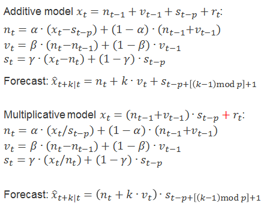

## Key Insights

- **How to differentiate additive model and multiplicative model with the plot of decompose function?**
  - the seasonal and random component should be oscillating around zero for an additive model
  - the seasonal and random component should be oscillating around one for a multiplicative model 


- **Why does differencing actually work to make a non-stationary time series stationary?**
  
  - insight from Chap 4 HW 3 (week 10): e.g.for a random walk, the absolute values are very different over time, but the **differences between subsequent values are not!**
  
- see below, left: random walk, right: 1-times differenced, looks way more stationary
  
  

+ Effect on the variance of random variables when the variables are scaled by a factor, $a$ : since variance is in term of squared factor of the variables, the new variance = $a^2 \times$ old variance

  ```R
  w1 <- rnorm(100000, mean = 0, sd = 2)  
  var(w1) # 4 
  var(2*w1) # 2^2*4 = 16  
  var(0.5*w1) # 0.5^2*4 = 1
  w2 <- rnorm(100000, mean = 0, sd = 1)
  var(0.5*w1+2*w2) # 0.5^2*4 + 2^2+1 = 5
  ```


## Summary

### Why are time series interesting to analyze?


- data = measurements of one or more variables over time, data points have a regular interval, e.g. daily, monthly, quarterly

- if the model is good enough to approximate the ground truth in data, you can make forecasts that will be approximately true

  –> leverage this in business/science/policy scenarios!

- **general assumption: observations from the past can be extrapolated to be used for predictions of the future!**  


### Ergodicity

+ A process is considered ergodic when its statistic properties can be derived from a single and long realization (time series observations) of the hypothetical model 
  + statistic properties: sample moments (mean, variance, skewness & kurtosis)
  + For a single realization, if we manage to stationarize it we'll obtain ergodicity
+ In social science simulation, we always need to assume ergodicity because e.g. real life event can only occur once and we only get a single realization of the process   
+ Egordicity is a sub-class of stationary 
  + All ergodic process must be stationary but not all stationary process are ergodic 
  + a time series with linear trend is not stationary and hence it is not ergodic 
+ **In all our analysis we need to assume ergodicity, because otherwise we can't derive anything meningful from a single observation with our statistical tools!**
+ Example of an ergodic process: Throwing coins -> we get the same statistic properties of the process when we throw 1000 different coins in one experiment vs. when we throw a single coin repeatedly for 1000 times 
+ Example of a non-ergodic process: Finding the most visited place -> observing the places visited by 1000 different people in a day vs. observing the places a person visited in 1000 days (We'll get different statistic properties!) 

### Decomposition 

+ as a tool to understanding a time series
  + find out the possible cause of variation 
  + figure out the structure of a time seris 
  + prelimary step before selecting/applying a forecasting method 
  
+ $n_t$: level (= the underlying value of a time series **not considering any fluctuations**) 

  $s_t$: seasonal (= fluctuations that occur in a fixed period)

  $r_t$: residuals (= what is not explained by the other components; should have constant variance over time –> homoskedasticity) 

- **other possible components**
  
  - trend (= steady in/decrease of the level)
  - cycle (= fluctuations that are more irregular than seasonality, period length might be unknown)
  
+ use `decompose()` function to analyze all the components (trend, seasonal and random)
  
  + we compare the fit of either the `additive` or `multiplicative` type by analyzing the random component (should look random without any trend and with the same variance over time)
  


#### Additive Model

+ $n_t + s_t + r_t$; mean of $s_t$ and $r_t$ should be 0 (so that the level is overall not influenced)

    ```R
  plot(decompose(x, type = "additive"))
  ```

#### Multiplicative Model

+ $n_t \cdot s_t \cdot r_t$; mean of $s_t$ and $r_t$ should be 1 (so that the level is overall not influenced)

    ```R
  plot(decompose(x, type = "multiplicative"))
  ```

+ use it when **seasonal effects tends to increase as the trend increases** 

+ if the random variables is modelled by a multiplicative factor & the variable is positive 
  
  + use $\log$ to transform to additive decomposition


#### Alternative Multiplicative 

+ $n_t \cdot s_t + r_t$; mean of $s_t$ should be 1 and mean of $r_t$ should be 0 

### Mathematical Transformations

- **intuition: Why do you transform a time series?**
  - **ultimate goal of modeling:** find a simple model that fits the data, because simpler models = better forecasts
  - different types of transformation can **remove different unwanted properties in the data**

#### Logarithmic

+ transforms a multiplicative model to an additive model
  
  + $x_t = n_t \cdot s_t \cdot e_t \Rightarrow y_t = ln(x_t) = ln(n_t) + ln(s_t) + ln(e_t)$  


+ **use case:** if the time series shows exponential growth, it is better to fit log(time series) as a model, as the time series will be more linear!
  
  = the transformation will make logarithmic behaviour look linearly!
  
+ A well-known example in economics: log return 
  
  + Return is defined as, $R_t = \frac{P_t - P_{t-1}}{P_{t-1}} = \frac{P_t}{P_{t-1}}-1$
  + Gross return is $R_t + 1 = \frac{P_t}{P_{t-1}}$ 
  + log return = log of gross return, $r_t = ln(R_t + 1) = ln(\frac{P_t}{P_{t-1}})=ln(P_t) - ln(P_{t-1})$
    + benefits of using log return: 
      1. if $ln(P_t)$ is a random walk then $\Delta ln(P_t)$ will be stationary (Chap 4 HW 3.R - Apple Stock price) 
      2. log return has nice properties: breakdown the multiplicative model of gross return in $k$ periods into additive model: $[R_t+1]_k = \frac{P_t}{P_{t-1}}\cdot\frac{P_{t-1}}{P_{t-2}}\cdot\frac{P_{t-2}}{P_{t-3}}\dots \frac{P_{t-k+1}}{P_{t-k}} \Rightarrow ln(\frac{P_t}{P_{t-1}}\cdot\frac{P_{t-1}}{P_{t-2}}\cdot\frac{P_{t-2}}{P_{t-3}}\dots \frac{P_{t-k+1}}{P_{t-k}})$
         $\Rightarrow ln((R_t +1)\cdot (R_{t-1}+1)\dots (R_{t-k+1}+1)) = ln(R_t +1) +  ln(R_{t-1}+1)+ \dots + ln(R_{t-k+1}+1)$ 
         $\Rightarrow r_t + r_{t-1} + \dots + r_{t-k+1}$ (summation of log return in $k$ periods = multiplicative of gross return in $k$ periods)  
      3. if returns are independent, then log returns are independent -> uncorrelatedness can be checked with `acf()` and variance of the additive model can be calculated easily:  $var([r_t]_k) = var(r_t) + var(r_{t-1})+ \dots + var(r_{t-k+1})$ but the variance of multiplicative model of gross return is NOT simply $var([R_t+1]_k) = var(R_t+1) \cdot var(R_{t-1}+1) \dots var(R_{t-k+1}+1)$


+ When we apply log transformation, the expectation & variance of the transformed value is not the function of the expectation & variance of the untransformed value! -> due to Jenson's inequality 
  
  –> **doing the logarithmic transformation changes the distribution of the data points!**
  
  + let $x_t := ln(r_t)$ ~ $N(0, \sigma^2)$ , the transformed value, $r_t = exp(x_t)$ `x = rnorm(1000, sd=2)`, ` r = exp(x)` 
  + `mean(r)` $\neq$ `exp(mean(x))` and `var(r)^0.5` $\neq$ `exp(var(x))^0.5` 
    + the correct formula is `mean(r)` = `exp(var(x)/2)` and `var(r)^0.5` = `(exp(var(x))*(exp(var(x))-1))^0.5`
    + $\mathbb{E}[r_t] = \mathbb{E}[exp(x_t)] \neq exp(\mathbb{E}[x_t]) = 1$ but $\mathbb{E[r_t]} = exp(\sigma^2/2)$
      + Jensen's inequality theorem says for all convex function,$f$ $\Rightarrow \mathbb{E[f(x)]} \ge f(\mathbb{E}[x])$
      + since exponential function is a convex function, $\mathbb{E}[r_t]$ must be larger than 1 
  
  
  
  + when a normally distributed variables undergo a tranformation with function that is convex, its distribution becomes right skewed (with fat right tail) as the convex function stretches the distribition of $r_t$ as $x_t$ increases -> recall how exponential function looks like (y value increases drastically as x value increase in small scale) 		

#### Box-Cox 

+ $$x_t = B(y_t, \lambda)=\left\{\begin{array}{ll} ln \left(y_{t}\right) & \text { if } \lambda=0 \\ \left(y_{t}^{\lambda}-1\right) / \lambda & \text { otherwise } \end{array}\right.$$

  + logarithmic + power transformation
    + the parameter **$\lambda$ determines the type of transformation**
    + for $\lambda = 1, y_t$ will not be transformed
    + $\lambda$ is a hyperparameter that needs to be estimated

+ to fix the non-normality of the residuals (remove heteroskedasticity/skewness in the residuals)
  + to make the pattern across the data more consistent -> more accurate forecast with data in normality 
  + address limitation of logarithmatic transformation: $y_t$ has to be positive 
  
+ from this:  to this: 

  –> if all the peaks have the same height, the data is "simpler"

+ **Caution:** OLS can not be used to estimate $\lambda$!

  + $\text{Given: } y_t > 1, \lambda \rightarrow-\infty\Rightarrow y_t \rightarrow 1, B(y_t, \lambda) \rightarrow 0 \forall t$ 

    –> the sum of squared error will be = zero!

    –> the suggested transformation **would transform the time series to a horizontal line that goes through the origin!**

  + instead, the profile likelihood is used

### Exponential Smoothing

- **intuition:** the smoothing effect results from using past observations to calculate the smoothed version of the current one
- best for data without clear trend/seasonality
- model without considering trend and seasonality, just model the current level using the past level value with the smoothing parameter, $\alpha \in (0,1)$ 
  -  if $\alpha\approx 1$, you give a lot of weight to the most recent observation
    - decreases exponentially as obs. go further in the past 
  - $n_0 = x_1$; $n_1 = \alpha x_1 + (1 - \alpha) n_0$  ->  derive the $k$-step ahead forecast equation [03_02_ExponentialSmoothing.pdf]
- can be seen as a simplification of Holt-Winters

### Holt-Winters Model

- to capture seasonality by smoothing with the consideration of trend and season of period 

- contains three components: level, trend, season

  –> one smoothing parameter for each of the components, $\alpha, \beta, \gamma$ 
  
  + get maximal smoothing when the smoothing parameter = 1; minimal smoothing when they are = 0

+ use additive method when -> seasonal variations are constant through the series 
  + seasonally adjust the level by subtracting the seasonal component (of last period) 
  + forecast formula: adding the seasonal part 
+ use multiplicative method when -> seasonal variations are changing **in propotion to the level of the series**
  + seasonally adjust the level by dividing the seasonal component (of last period) 
  + forecast formula: multiplying the seasonal part  
  –> one smoothing parameter for each of the components, $\alpha, \beta, \gamma \in [0,1]$  

  - if = 0 the respective component will be maximally, if = 1 it will be minimally smoothed

  

+ use additive method when -> seasonal variations are constant through the series 

+ use multiplicative method when -> seasonal variations are changing **in proportion to the level of the series**

### White Noise

- white noise = the simplest stochastic model

  –> **it is not a proper model, but what the residuals/randomness in a model should look like!**

- a time series is called white noise if **its data points are i.i.d. distributed with mean = 0**

- **model equation:** $w_t \sim \mathcal{N}(0,\sigma^2)$ 

- **properties**

  - **expected value** $\mu= E[w_t]=0$ is calculated as $m_n= \frac{1}{n}\sum_{t=1}^n w_t$ 

    –> theoretically, mean = average should be zero!

  - **autocovariance** $\gamma_k = Cov[w_t,w_{t+k}]= \left\{\begin{array}{ll} \sigma^2 & \text { for } k=0\\ 0 & \text { for }  k\neq0\end{array}\right.$ is calculated as $c_{k,n}= \frac{1}{n}\sum_{t=1}^{n-k}(w_t-m_n)(w_{t+k}-m_n)$ 

    –> theoretically, there should be no autocovariance between different white noise data points = statistically independent!

  - **autocorrelation** $\rho_k = Cor[w_t,w_{t+k}]= \frac{\gamma_k}{\sigma^2}= \left\{\begin{array}{ll} 1 & \text { for } k=0\\ 0 & \text { for }  k\neq0\end{array}\right.$ is calculated as $r_{k,n}= \frac{c_{k,n}}{c_{0,n}}$  

    –> there should be no autocorrelation in the time series!
    
    + use the autocorrelation plot obtained with `acf()`

- in practice, the mean is usually never == 0, so you **test whether the mean is significantly different from zero using the covariance!** (???)


#### Code Snippets

- **How to create white noise**: `w <- rnorm(n, sd = 20)`
  - we create it sampling from a normal distribution with mean zero
  - parameters to specify: standard deviation `sd`, number of samples `n`
- **How to check whether there is randomness in autocorrelation**:  
  - `acf()` calculates the correlation between the time series and a lagged version of itself!
  - y-axis = ACF, x-axis = lag (–> How many steps was the time series shifted?)
  - **at lag 0, ACF = 1 (this is always the case, because by definition $c_{0,n}/c_{0,n} =1$)**; **at other lags, ACF = 0 **
    - in reality, ACF at other lags would not be exactly = 0 but close enough to zero 
    - how to conclude this null hypothesis? -> hypothesis testing with significant level of 5% (the dashed line) 
      - How would you calculate it? -> It shows the allowed bound of our null hypothesis! - it's $1.96/\sqrt{n} $!
    - if we have a plot with lag=40, considering 5% significant level, then only at 40*0.05 = 2 lags should cross this dashed line
- **How to check whether the mean is significantly different from zero:**
  - if $1.96 \times \sigma/\sqrt{n}$ is larger than the mean of the series 
  - `1.96*sd(w)/n^0.5 > mean(w)`

### Random Walk

- example for a **non-stationary, non-ergodic** model, due to its properties!

- **random walk of order 1**: $x_t = x_{t-1}+w_t$ 

  –> **intuition:** "the value of tomorrow is equal to the value of today + a random value"

  + it is the **accumulation of random deviations from prev steps** until the current time
      + `for (t in 2:1000) x[t] <- x[t-1]+w[t]`
      + generalized eqn: $x_t = x_0 + \sum_{i=1}^tw_i$ 

  = **long-memory process** -> due to high autocorrelation of all past obs. 

- **properties**

  - **expected value** $\mu= E[x_t]=E[x_0+\sum_{i=1}^tw_i]= x_0$

    –> the expected value is equal to the first value of the time series

  - **autocovariance** $\gamma_k = Cov[x_t,x_{t+k}] = \sum_{i=j}Cov[w_i,w_j]=t\sigma^2$

    –> the covariance is time dependent and thus becomes infinitely large for $t \rightarrow \infty$  

    

  - **autocorrelation** $\gamma_k = Cor[x_t,x_{t+k}] = \frac{1}{\sqrt{1+k/t}}$ 

    –> for large t, the denominator is $\approx 0$ and autocorrelation approaches 1, **so values of a time series heavily depend on previous ones!** 

- **random walk with drift:** $x_t = \vartheta+x_{t-1}+w_t$

  - rephrased to: $x_t = x_0+\vartheta t+\sum_{i=1}^t w_i$ 
  - the drift implies that the value of the time series is constantly in/decreasing over time
  - **only difference in property:** **expected value** $\mu= E[x_t]= x_0+\vartheta t$

- the **difference operator**  makes a random walk stationary!

  - **Differencing Operator** 
    + Differencing turns out to be a useful operating that can transform a non-stationary ts (e.g. random walk) to a stationary ts (e.g. white noise)
    + the difference operator is defined by: $\nabla x_t = x_t-x_{t-1}$; rewrite as $\nabla x_t=(1-\textbf{B})x_t$
      + in general term: $\nabla^n = (1-\textbf{B})^n$
    + the first-order differences of a random walk are white noise series, so we can check the acf of the differece operation -> `acf(diff(x))`

#### Comparison of random walk and random walk with drift 


+ the drift term introduce a deterministic trend, $\vartheta$ in the expected value in random walk with drift model -> so we observe a random walk with a slope! 
  + both random walk with/without drift have autocovariance that depends on time, $t\sigma^2$ -> as time increases, deviates more from the mean (dashed line in the graph)  
+ The **variance of the random walk with/without drift increases without bound** as it increases as $t$ increases -> so only suitable for short term predictions
+ autocovariance function of a random walk with/without drift **depends on the particular time values, $t$ and $t+k$,** but **not on the lag** -> weakly stationarity 
+ The deterministic part of the model will dominate the stochastic component (come from the white noise) over the long run because the deterministic trend, $\vartheta$  is proportional to $t$; the stochastic trend depends only on the $\sigma$ which is in proportion to the $\sqrt{t}$

#### Code Snippets

- **How to generate a random walk**

  ```R
  # random walk with lag 1 without intercept
  for (t in 2:1000) x[t] <- x[t-1]+w[t]
  ```

- **How to identify a random walk using `acf()`**
  
  - the autocorrelations will be very high for all lags!
  
    –> **this is the same for a random walk with drift!**
  
    
    
    + `acf(x)` -> use with caution because random walk is not ergodic, meaning it's not stationary in mean and in the variance; random walk violate the stationarity in the variance
    
    + for large values of k, we slowly approach 0
    
      –> look at formula for autocorrelation
    
    + for large $t$ with $k$ considerably less than $t$, we have $p_k$ is nearly 1 -> we have a positive autocorrelation that decay very slown down from unity -> check definition of autocorrelation above 

### AR(1)

- simplest auto-regressive model

- **model equation** $x_t=\alpha_0+\alpha_1 x_{t-1}+w_t$

  - $|\alpha_1|<1$: auto-regressive process
  - $\alpha_1 = 1$ : random walk with drift
  - $\alpha_0 = 0$ & $\alpha_1 = 1$: random walk
  - $\alpha_1>1$: explosive process

- **properties**

  - **mean** $\mu(t)= E[x_t]= \alpha_0\cdot \frac{1-\alpha_1^t}{1-\alpha_1}+\alpha_1^t\cdot x_0 \xrightarrow{t\rightarrow\infty} \frac{\alpha_0}{1-\alpha_1}$  

  - **autocovariance** $\gamma_k(t) \xrightarrow{t\rightarrow\infty} \frac{\alpha^k\cdot \sigma^2}{1-\alpha_1^2}$ 

  - **autocorrelation** $\rho_k(t)= \frac{\gamma_k(t)}{\gamma_0(t)}= \alpha_1^k$  -> **autocorrelation decays to zero more rapidly for small $\alpha_1$**  

    with $\gamma_0(t) \rightarrow \frac{\sigma^2}{1-\alpha_1}$ 

  –> time series are (only) asymptotically stationary, because its properties have no dependence on t!

#### AR(1) without constant term

- **properties**

  - **mean** $\mu(t)= E[x_t]= \alpha^t\cdot x_0 \xrightarrow{t\rightarrow\infty} 0$ 

    –> mean will go to zero for large values of t

#### Comparison to random walk model 

+ As compared to random walk with drift, we have a $\alpha$ coefficient for the past value, $x_{t-1}$; we don't have a long memory process, so there is no smooth upward & down trend now 
+ Random walk is smoother than AR(1), which is smoother than white noise model; Autocorrelation of AR(1) decays quicker than the random walk -> AR(1) process has a closer resemblence to the white noise model than the random walk process 


- **compare white noise, random walk (with drift) and AR(1) by eyeballing**


–> **the interval of values is quite large**


#### Parameter Estimation (ML, OLS) 

- use ordinary least squares (OLS)

  - minimize the sum of squared errors
  - $SSE = \sum_t(x_t-(\alpha_0+\alpha_1\cdot x_{t-1}))^2$
  - find parameters such that $\frac{\part}{\part\alpha_1}SSE=0$
  - **translates to:** "minimize the squared sum of the difference between the data points and an AR(1) model"

  $$
  \begin{align}
  \frac{\part}{\part\alpha}SSE=0\\
  \frac{\part}{\part\alpha}\sum_{t=1}^{n-1}(x_{t+1}-\alpha x_t)^2 = 0\\
  -2\sum_t (x_{t+1}-\alpha x_t) x_t=0\\
  \dots \\
  \alpha = \frac{\sum_{t=2}^nx_t\cdot x_{t-1}}{\sum_{t=1}^{n-1}x_t^2}\\
  \text{substitute } x_t = \alpha x_{t-1}+w_t \text{ to get:}\\
  \hat\alpha = \alpha + \text{bias term}
  \end{align}
  $$

  

  - **there will be a bias $\neq 0$ in the parameter estimate!** 

    –> $\alpha \neq E[\hat\alpha]$ 

- use maximum likelihood (ML)

  - "Maximize the log-densitiy of the joint Gaussian density "

#### Code snippets

- **How to generate an AR(1) process without intercept**

  ```R
  for (t in 2:1000) x[t] <- 0.7*x[t-1]+w[t]
  ```

  - it is an AR(1) process and no random walk because $\alpha = 0.7\neq1$ 

### Bootstrapping

- bootstrapping is **useful when you don't know the distribution of the residuals** 
- you do sampling with replacement
- **intuition:** you approximate the unknown distribution you sample from by taking many samples from which you can **calculate mean + standard deviation**
- in our case, we apply bootstrapping to sample from residuals in order to calculate k-step ahead forecasts

#### Code Snippets

- **How to do bootstrapping with `boot()`**
- **How to do bootstrapping with `sample()`**

### AR(p) model

+ **Key idea: current values of the series, $x_t$ can be explained as a function of $p$ past values**, $x_{t-1}, x_{t-2}, ..., x_{t-p}$ where $p$ determines the number of time step we need to step into the past in order for us to forecast the current value! 
+ Model eqn: $x_t = \alpha_0 + \alpha_{t-1} +...+ \alpha_px_{t-p} + w_t$
    + with the lag operator, rewrite to: $(1- \alpha_1L - ...-\alpha_pL^p) x_t = \alpha_0 + w_t$ 
    + $L \cdot x_t = x_{t-1}$
    + $L^nx_t = x_{t-n}$

### Stationarity

- formal definitions of the types of stationarity we encounter
- **"A time series is…"**
  - **(weakly) stationary**
    - "… if mean + variance of a time series are constant (can be large, but $<\infty$)." 
    - this is the most often used notion of stationarity
  - **trend-stationary**
    - "… if the time series is stationaryafter a constant, deterministic trend term $\beta t$ is subtracted."
  - **difference-stationary**
    - "…if the one-times differenced time series $\Delta x_t$ is stationary."
  - **strictly stationary**
    - "…if the distribution of data points across all lagged versions  $x_{t+k}$ are identical to $x_t$." 
    - we never use this

- **differencing a time series means using the difference operator like this: **

  

### Testing for Stationarity (= unit roots)/ Augmented Dickey-Fuller test

- **we test for stationarity using an alternative form of the AR(1)/AR(p) model equation**
  - by rearranging we achieve: $\Delta x_t = \alpha_0+ \delta x_{t-1}+w_t$ (AR(1))

  - or $\Delta x_t = \alpha_0+\delta x_{t-1}+\sum_{i=1}^{p-1}\tilde\alpha_i\Delta x_{t-1} +w_t$ AR(p), respectively

    where  $\delta = \alpha_1+\dots+\alpha_p-1$ 

- **intuition: Do the model coefficients $\alpha_i, \alpha_0, \delta$ take on specific values (= Are their values restricted, e.g. equal to zero or one)?**

- **the existence of unit roots mean that the process is non-stationary!**
  
  - unit roots = restriction on the model coefficients $\alpha$
  
  - for AR(1) –> $\alpha_1=1\iff \delta = 0$

    - the process will be stationary, if all roots are $>1$, because
  
    $$
    \begin{align}
    x_t&= \alpha_0+\alpha_1x_{t-1} + w_t\\
    x_t-\alpha_1x_{t-1} &= \alpha_0+w_t\\
    (1-\alpha_1L)x_t&= \alpha_0+w_t\\
    1-\alpha_1L & \text{ is the characteristic polynomial }\\
    &\text{set to zero and solve to obtain roots}\\
    1-\alpha_1L &=0\\
    L &=\frac{1}{\alpha_1}
    \end{align}
    $$
  
    **–> if $0<\alpha_1<1$, the root will be $>1$!** 
  
  - for AR(p) –> $\sum_i \alpha_i = 1 \iff \delta = 0$ (sum of coefficients is deciding)
  
  - in practice, we do not solve the characteristic equation, because the roots may be complex
  
    –> do the Dickey-Fuller test instead
  
- **null hypothesis:** "The parameter restrictions hold." -> testing for $\delta = (1-\alpha_1) =0$  

  - for AR(1) –> $\alpha_1=1$
  - for AR(p) –> $\sum_i \alpha_i = 1$ 
  - if we cannot reject $H_0$ -> we'll get a random walk -> not stationary process 

- **alternative hypothesis:** "The parameter restrictions do not hold." -> testing for $\delta < 0 $ (correspond to $|\alpha| < 1$) 

  - if we can reject $H_0$ -> we'll get an AR process -> stationary process 

- the critical values for significance of the value of the test statistic are obtained **from the student-t or the Dickey Fuller distribution**

  - the Dickey-Fuller distribution is used because **its power is weak**

    –> **there is only a low probability to reject the null hypothesis when it is false**

- **table of test statistics**
  
  - where test statistics $\tau= \frac{\hat\delta}{\sqrt{\hat{ Var}[\hat\delta]}}$ 
    
    - $\hat\delta$ is obtained by OLS estimation of the respective model equation
    
  - where test statistics $\phi = \frac{SSE_R-SSE}{r}/\frac{SSE}{n-k}$
    
    (same approach as test statistics of F-tests) 
    
    - $SSE$: sum of squared residuals of the **unrestricted** model
    
      –> fit obtained with the **model equation from the alternative hypothesis**
    
    - $SSE_R$: sum of squared residuals of the **restricted** model
    
      –> fit obtained with the **model equation from the null hypothesis**
    
    - $k$: number of parameters of the unrestricted model (i=1⇒k=2;i=2,3⇒k=3)
    
    - $r$: number of restrictions (i=1,3⇒r=2;i=2⇒r=3)
    
    - $n$: number of observations
  
- **intuition:** we test whether the restrictions on the model coefficients, e.g. for phi1, $\alpha_0=\delta=0$ are likely to be true or not, given our time series

- Dickey-Fuller test only considered the AR(1), an extension of it, augmented Dickey-Fuller test allows higher order of $p$ in the autoregressive process: 
  $$
  \Delta y_{t}=\alpha+\beta t+\gamma y_{t-1}+\delta_{1} \Delta y_{t-1}+\cdots+\delta_{p-1} \Delta y_{t-p+1}+\varepsilon_{t}
  \\
  \text{Rearranging terms:} \quad
  \Delta x_{t}=\alpha_{0}+\beta \cdot t+\delta \cdot x_{t-1}+\sum_{i=1}^{p-1} \tilde{\alpha}_{i} \Delta x_{t-i}+w_{t}
  $$
  => with augmented Dickey-Fuller test the model with $p$ order, we need to find out the exact lag order, $p$ when applying the test -> use AIC/ BIC

  + do Dickey-Fuller test using `ur.df()` function 
  + set the lag order using the lags argument; `lags=3` or set AIC/BIC in selectlags argument - `selectlags=BIC` -> check `ur.df` documentation for detailed usage 


- **model selection tree**
  - start at the top to do model selection
  
    –> we start with a general model (with trend + intercept) and then step-by-step exclude possibilities
  
  - start at the bottom when following the Pantula principle to determine the order of integration ($\leq 3$)


+ **Order of Integration** 
  + tell us how many times we need to difference a time series to get a stationary process 
  + order of integration = no. of unit roots 

#### Code Snippets

- **How to determine the order of integration with the Pantula principle**

  ```R
  # additional options: lags =, selectlags =
  summary(ur.df(d3x, type = "none"))
  summary(ur.df(d2x, type = "drift"))
  summary(ur.df(d1x, type = "trend"))
  ```

  - general idea:  
    - If you find that the differenced time series is stationary, do the next test with the time series
    - We assume the series has at most quadratic trend -> we difference not more than 3 times to obtain a stationary process
      - testing in descending order: d=3 -> d=2 -> d=1 
        - if we failed to reject the $H_0$ at order $d$ -> correct order of integration = $d+1$
    
  - <u>example: identifying that a time series has order of integration 2 = I(2)</u>

    1. `summary(ur.df(d3x, type = "none"))`

       - all test statistics are above thecritical values for 5 % significance, the null hypotheses are rejected

         –> the 3-times differenced time series is stationary

    2. `summary(ur.df(d2x, type = "drift"))`

       - the test statistics are not above the critical values for 5 % significance, the null hypothesis is not rejected
       - if e.g. phi2 is large enough, conclude that the model is a random walk with drift

       –> conclude that the order of integration = 2, do model selection from here on

- **How to do model selection like above using `ur.df()`**

  ```R
  summary(ur.df(x, type = "trend")) # tests tau3, phi2, phi3
  summary(ur.df(x, type = "drift")) # tests tau2, phi1
  summary(ur.df(x, type = "none"))  # tests tau1
  ```

  - model coefficients
    - `z` corresponds to x (time series) 
    - `z.diff` correponds to $\Delta x_t$ here
    - `intercept` corresponds to $\alpha_0$
    - `t.t` corresponds to $\beta$ (= trend)
    - `z.lag.one` corresponds to "coefficient of $x_{t-1}$" ($\delta$) 
    - `z.diff.lag.i` corresponds to $\tilde \alpha_i$

- **How to find the model equation in the shape $x_t=\dots$ after doing model selection** 

  - select the correct function call of `ur.df()`

    - **CAUTION:** use the function call where the input is a stationary time series!

      –> for a non-stationary process (= model selection identified a random walk) you have to fit d1x or d1x instead of x directly!

  - identify which model parameters are significant using `summary(ur.df(...))`
  - optionally: refit again using only the significant parameters with `restrict()`
  - if fitting a differenced time series, rearrange terms of the model equstion
  - optionally: check for unit root by calculating $\sum_i\alpha_i$

+ **How to find the model equation given a time series data:**
  1. Determine the order of integration using Pantula principle to perform Dickey-Fuller test (walking up the model selection tree)
  2. 

### Differencing too often (= infinite lag order)

### Determining the lag order p

#### Using partial autocorrelation

#### Using information criteria

### Checking model residuals for autocorrelation (Ljung-Box tests)

### Checking model residuals for stability/breakpoints (Chow test)

### ARIMA

### Seasonal ARIMA

### VAR(p)

### Cointegration

+ If there exists some linear combinations of some parameters of both nonstationary processes which results in a stationary process. This is called the cointegrating relation.  

+ Cointegrating relation is a **mean reverting process**. (converges to a mean value) The long term forecast of the cointegrated series are linearly related. 

+ Rank$(\Pi)$ tell us the no. of cointegrating relations. 

### VAR 

+ a multivariate model with multiple no. of AR($p$): $X_{t} = A_0 +A_1X_{t-1} +...+ A_pX_{t-p} + R_t$ series up to $k$
$\Rightarrow X_t =A_0 + A_iX_{t-i} + R_t$ where $A_i$ is a $k \times k$ matrix, with coefficients in each row e.g. $\alpha_{11,1}, \alpha_{12,1}, ...,\alpha_{1k,1}$ expresses granger causality of all other series e.g. $x_{2t},...,x_{kt}$ for this corresponding series in the row, e.g. $x_{1t}$ 
$$
\left[\begin{array}{c}
\mathbf{x}_{1t} \\
\mathbf{x}_{2t} \\
\vdots \\
\mathbf{x}_{kt}
\end{array}\right]=\left[\begin{array}{c}
\alpha_1 \\
\alpha_2 \\
\vdots \\
\alpha_k
\end{array}\right]+\left[\begin{array}{ccccc}
\alpha_{11,i} & \alpha_{12,i} & \cdots & \alpha_{1k,i} \\
\alpha_{21,i} & \alpha_{22,i} & \cdots & \alpha_{2k,i} \\
\vdots & \vdots & \ddots & \vdots \\
\alpha_{k1,i} & \alpha_{k2,i} & \cdots & \alpha_{kk,i} \\
\end{array}\right]\left[\begin{array}{c}
\mathbf{x}_{1t-i} \\
\mathbf{x}_{2t-i} \\
\vdots \\
\mathbf{x}_{kt-i}
\end{array}\right]+\left[\begin{array}{c}
\mathbf{r}_{1t} \\
\mathbf{r}_{2t} \\
\vdots \\
\mathbf{r}_{kt} \\
\end{array}\right]
$$
$i = p =$ no. of lags; $k =$ no. of series in the system; first index of $\alpha$ = $k^{th}$ series, second index of $\alpha$ 
+ from this eqn, we can see that no. of parameters of the model: $k+k^2 \times p$
+ no. of lag define the how many $A_i$ matrices we'll have 
+ no. of series define the size of $A_i$ matrices -> always a $k\times k$ matrix 
+ $R_t$ is a zero mean white noise process with a positive definite covariance matrix: $R_t$~ $(0,\Sigma_R)$ where $\Sigma_R = \mathbb{E}[R_t R_t']$
  + $R_t$ can be generated from cholesky decomposition or simply by adding two i.i.d generated white noise and combine with one of the white noise series 

*e.g. for a VAR model with 3 series of lag order=2:*
+ $k=3$ -> $X_t, A_0, R_t$ will be a column vector of 3 ; 2 $A_i$ -> $A_1$, $A_2$ where each is a $3 \times 3$ matrix 
+ total no. of parameters = 3 + 9x2 = 21 parameters 

**To check the stability in a VAR model**: 

+ $\text{det}\left(I_{k}-A_{1} z-\cdots-A_{p} z^{p}\right)=0$ lie outside of the unit circle (> 1 in absolute value)

### VECM

Given a VAR($p$) of I(1): 
$X_t = A_0 + A_1 X_{t-1} + ... + A_p X_{t-p} + R$

There always exists an **error correction** representation of the form:
$\Delta X_{t}=A_{0}+\Pi X_{t-1}+\Gamma_{1} \Delta X_{t-1}+\cdots+\Gamma_{p-1} \Delta X_{t-p+1}+R_{t}$

where
$\Pi=-\left(I_{k}-A_{1}-\cdots-A_{p}\right), \Gamma_{i}=-\left(A_{i+1}+\cdots+A_{p}\right)$
e.g. $k=3, p=2$: `-(diag(3)-A1-A2)` while `A1, A2` is $3 \times 3$ matrices

**Interpretation of VECM:**

+ if $\Pi=0$, all $\lambda(\Pi)=0$, rank=0 -> **no cointegration**; Non-stationary of I(1) vanishes by taking the differences -> we **fit $\Delta X_t$**
+ if $\Pi$ has full rank, $k$, then VAR($p$) is stationary, cannot be I(1) -> **fit VAR model directly**
+ if rank$(\Pi) =m$, $0<m<k$ -> the case of cointegration, we write $\Pi=\alpha\beta'; (k \times k) =(k \times m)[(k \times m)']$ -> **fit VECM($p-1$) model**

### Johansen Test 

+ A procedure to determine the rank of $\Pi$ and whether there is a trend in the cointegrating relations  
  + First, 
+ $H_1^*$ -> $A_0 = \alpha \cdot\beta_0, B=0$: no trend in levels, no trend in cointegrating relations -> **(ecdet="constant")**
`z.vecm<-my.ca.jo(z, type = "trace", spec = "transitory",ecdet="const",K=2)`
+ $H_1$ -> $A_0 \neq 0 , B=0$: linear trend in levels, no trend in cointegrating relations, drift in differences -> **(ecdet="none")**
`z.vecm<-my.ca.jo(z, type = "trace", spec = "transitory",ecdet="none",K=2)`
+ $H^*$ -> $A_0 \neq 0, B= \alpha \cdot \beta_1$: linear trend in levels, linear trend in cointegrating relations, drift in differences -> **(ecdet="trend")**
`z.vecm<-my.ca.jo(z, type = "trace", spec = "transitory",ecdet="trend",K=2)`

#### Checking the cointegrating rank and the presence of trend in the series

+ Check the hypotheses, $H^*_1$ and $H_1$ starting from rank =0 in an alternating order up to the full rank, $k$. 
+ Stop the test when the test statistic is smaller than the significant level (cannot reject the $H_0$) so we accept the $H_0$ which is under the assumption that the rank we are testing is the true rank.  

> When the series has an obvious trend, skip $H_1^*$ and proceed to $H_1$ but we can't know whether the cointegrating relations have a trend, so test $H_1$ against $H^*$

#### Checking whether the cointegrating relations are stationary with no trend

**Testing $H_1$ against $H^*$**: 

+ Hypothesis: no trend in cointegrating relations
+ teststat is chi-square distributed 
+ The likelihood ratio test statistic:
  $$T \sum_{j=1}^{r} \ln \left(\left(1-\lambda_{j}^{1}\right) /\left(1-\lambda_{j}^{*}\right)\right)$$
  + if there is no trend in cointegrating relations, $\lambda^*_j$ will be similar to $\lambda^1_j$ so we will log a value which is close to 1, $ln(1) = 0$ so we'll sum up a value that is close to zero -> test statistic will be small hence cannot reject $H_0$  

## Definitions (A-Z)

- **Cholesky decomposition**

  - method to decompose a positive-definite matrix into a lower triangular matrix (and its transpose)
- speeds up solving linear equation systems
  
- $A = LL^T$, e.g.  
  
- **deterministic trend**

- **difference operator** $\nabla x_t = x_t-x_{t-1}$

  - this gives you the difference between current and previous value 

    –> the resulting time series depicts relative changes and no absolute values!

  - is most importantly **used to make a non-stationary time series stationary**

- **drift vs. trend**

  - drift = intercept = $\alpha_0$ 
  - (deterministic) trend, indicated by $\beta t$ in the AR(p) model equations
  
- **lag operator** $L = x_{t-1}$

  - returns the value of one/$k$ time step(s) before t
  - equivalent to backshift operator $\mathbf{B}$ 
  - can be used an arbitrary, k times –> $L^kx_t = x_{t-k}$
  - is most importantly used to **calculate autocorrelation of a time series**
  - **lagging a time series reduces n (= number of observations)** 
  - another application: create the lagged time series for model fit using `lm()`

- **moment** (in statistics)

  - a quantitative property of a function/distribution/sample of data points
  - first: expected value/mean
  - second: varaince
  - third: skewness
  - fourth: kurtosis

- **order of integration $d$** 

  = a time series needs to be differenced $d$ times to be stationary

  - In case we <u>can not</u> reject $H(d-1)$, the order of integration is $d$. 

- **stochastic trend**

  - see Enders, p. 181

## The Formula Vault

- expected value $\mathbb{E}[x]$ 
- variance of a sample: $var(x)=\sum_{i=1}^n(x-\bar{x})^2/(n-1) = cov(x,x)$

- standard deviation: $\sigma= \sqrt{ \text{variance}}$

- covariance of two variables $cov(x,y)= \sum_{i=1}^n(x-\bar{x})(y-\bar{y})/(n-1)$

- correlation $corr(x,y)= \frac{cov(x,y)}{\sigma_x\sigma_y}$ 

- standard error $\sigma_\mu = \frac{\sigma}{\sqrt{n}}$


- **Exponential Smoothing**: $x_t = n_{t-1}+r_t$

  with $n_{t}=(1-\alpha)^{t-1} \cdot x_{1}+\sum_{i=0}^{t-2}(1-\alpha)^{i} \cdot \alpha \cdot x_{t-i}$

  - $\hat x_{t+k|t}= n_t$ 


- **Holt-Winters model**

- **additive model** $x_t=n_{t-1}+v_{t-1}+s_{t-p}+r_t$
- $n_{t}=\alpha \cdot\left(x_{t}-s_{t-p}\right)+(1-\alpha) \cdot\left(n_{t-1}+v_{t-1}\right)$
    $v_{t}=\beta \cdot\left(n_{t}-n_{t-1}\right)+(1-\beta) \cdot v_{t-1}$
    $s_{t}=\gamma \cdot\left(x_{t}-n_{t}\right)+(1-\gamma) \cdot s_{t-p}$
  
  - forecast: $\hat{x}_{t+k \mid t}=n_{t}+k \cdot v_{t}+s_{t-p+[(k-1) \bmod p]+1}$
- **multiplicative model** $x_t=(n_{t-1}+v_{t-1})s_{t-p}+r_t$

    - $n_{t}=\alpha \cdot\left(x_{t}/s_{t-p}\right)+(1-\alpha) \cdot\left(n_{t-1}+v_{t-1}\right)$
      $v_{t}=\beta \cdot\left(n_{t}-n_{t-1}\right)+(1-\beta) \cdot v_{t-1}$
      $s_{t}=\gamma \cdot\left(x_{t}/n_{t}\right)+(1-\gamma) \cdot s_{t-p}$
    - forecast: $\hat{x}_{t+k \mid t}=(n_{t}+k \cdot v_{t})s_{t-p+[(k-1) \bmod p]+1}$

- **difference operator** $\nabla x_t = x_t-x_{t-1}\iff \nabla x_t = (1-L)x_t$ 

  - also: $\nabla^2 x_t= \nabla(\nabla x_t)= \nabla x_t-\nabla x_{t-1}$  
  - and: $\nabla^3 x_t = \nabla (\nabla x_t - \nabla x_{t-1})= \nabla^2 x_t - \nabla^2 x_{t-1}$
  - generally speaking: $\nabla^ix_t = (1-L)^ix_t$ 

- **white noise**

  - $x_t = w_t$
  - $\mu=\mathbb{E}[w_t] = 0$
  - $Cov[w_t,w_t] = \sigma^2$ 

- **random walk**

  - $x_t = x_{t-1}+w_t =  x_0+\sum_{i=1}^tw_i$  
  - $\mu=\mathbb{E}[w_t] = x_0$ 
  - $\gamma_k(t)=Cov(x_t,x_{t+k})= t\sigma^2$ 
  - $\rho_k(t)= \frac{1}{\sqrt{1+\frac{k}{t}}}$ 

- **random walk with drift**

  - $x_t = \vartheta+x_{t-1}+ w_t$ **this is only the first order!**
  - $\mu=E[X_t]=x_0+\vartheta\cdot t$ 

- **AR(1) process**

  - $x_t = \alpha_0 +\alpha_1x_{t-1}+w_t$
  - $\mu=E[X_t]=^{t\rightarrow \infty}\frac{\alpha_0}{1-\alpha_1}$

- **AR(p) process** (= autoregressive)

  - $x_t= \alpha_0 +\alpha_1x_{t-1}+\dots+\alpha_px_{t-p}+w_t$ 

- **MA(q) process **(= moving average)

  - $x_t = c_0+w_t+\theta_1w_{t-1}+\dots+\theta_qw_{t-q}$ 

    rewritten as $x_t = c_0+\theta(L)w_t$ 

- **ARMA(p,q) process**

  - $x_t = \alpha_0+\sum_{i=1}^p\alpha_ix_{t-1}+ w_t+\sum_{j=1}^q\theta_jw_{t-j}$ 

    rewritten as $\alpha(L)x_t= \alpha_o+\theta(L)w_t$ 

- ARIMA

- **Seasonal $ARIMA(p,d,q)(P,D,Q)_s$**

- **VAR(p)**: $X_t =A_0 + A_iX_{t-i} + R_t$

  - $k$ is the no. of series in the system
  - $i$ is the no. of lag
  - $X_t$, $X_{t-i}$, $A_0$ and $R_t$ is a $k$-dimension column vector 
  - $A_i$ is a $k \times k$ matrix 

- **VECM (= vector error correction model)**: $\Delta X_{t}=A_{0}+\Pi X_{t-1}+\Gamma_{1} \Delta X_{t-1}+\cdots+\Gamma_{p-1} \Delta X_{t-p+1}+R_{t}$

  + $\Pi=-\left(I_{k}-A_{1}-\cdots-A_{p}\right), \Gamma_{i}=-\left(A_{i+1}+\cdots+A_{p}\right)$
  + $\Pi = \alpha \cdot \beta'$ 
  + cointegrating relations: $\beta'X_{t-i}$

## Documentation of Key R Functions

- examining a time series object

  - `class()`
  - `start()`
  - `end()`
  - `frequency()` 
  - `fix()`: show the structure (data of the time series), Tsp attribute and the class attribute 

- creating a times series object 

  - `y<-structure(c(4,5,6,7), tsp=c(2017.75, 2018.5, 4), class="ts")` 
    - `.Tsp=c(2017.75, 2018.5, 4)` is valid as well 
  - Tsp attribute tells us the start time & end time (in time units) and the frequency: `attr(ts, "tsp")` but not `attr(ts, ".Tsp")`! 
    - start time & end time in time units are calculated as `time + i/f`, where `i` is the period of that time -1 
      - `start(y)` # 2017 4 -> 2017+ 3/4 = 2017.75
      - `end(y)` # 2018 3 ->  2018 + 2/4 = 2018.5
  - convert from other data type to a time series object: `ts()`
    - `ts(x, start = c(2020, 1), freq = 12)`

- Quick check on the trend & seasonal effect of a time series object 

  - `aggregate(ts)`: sum up all observations by each period (e.g. aggegate each month data across multiple years)
  - `cycle(ts)`: give the position in the cycle (e.g. Jan=1, Feb=2, etc.)
  - `window()`: extract all observations of particular period across years e.g. `window(AP, start=c(1949,7), end=c(1957,7) freq=TRUE)`
    - if end argument is not specified -> include up to the last year available in the data

- `decompose()`: default type is addictive; `decompose(ts, type="mult")`

- `HoltWinters()`

  - x
  - alpha, beta, gamma
    - if `beta = FALSE`, exponential smoothing is done
    - if `gamma = FALSE`, no sesonality is fitted
  - seasonal = c("additive", "multiplicative")

- `acf()` plots the autocorrelogram of a time series

  - tell if a series is stationary or not -> if it is, ACF will drop to zero relatively quickly; non-stationary series, ACF will decreases slowly (value of the autocorrelation is large & positive) 

- log-transform a time series:

- Box-Cox transform a time series: 

- create a random walk:

- create a random walk with drift:

- create AR(1) time series:

- `diff()` 

  - implements the lag/backshift operator

  - option `differences = ` 

    –> How many times should the time series be differenced

  - **used for:** 

    - create the differenced time series as input to **determine the order of integration using the Pantula Principle**

  

- `ar()`

  - input: a time series
  - outputs the $\alpha$ parameters of an AR(p) model that best fits the data

- `polyroot()`

  - outputs the roots of a polynomial, be they real or complex numbers

- Do a Dickey-Fuller test: `ur.df()`

  - `"trend"`
    - most general, unrestricted model: contains
    - test statistic: $\tau_\tau, \phi_3, \phi_2$
  - `"drift"`
    - test statistic: $\tau_\mu, \phi_2$ 
  - `"none"`
    - no intercept and no deterministic trend
    - test statistic: $\tau$

- `pacf()` partial autocorrelation plot

  - 
  - is used to determine the lag order p of an AR(p) process

- […]

- conduct a **Chow breakpoint test**

  - calculate the F statistic with `Fstats`

- calculate the probability of that value to test for the significance of that value with `pf()` 

- `fs$breakpoint` gives you the largest value for the F-statistic in that interval

  = the most unlikely value where the p-value will be smallest!

- `arima.sim()` to generate an ARIMA time series

  - it is not possible to specify a drift/intercept

- `arima(x, order = c(p,d,q))` to estimate the coefficients given that the orders are known

  - `s.e.` are

- […]

*week 12*

- `VAR()` 

  1. to estimate the order p of an VAR(p) process

  1. to fit a model = obtain the coefficients, given p

- `vars::restrict()`

  - removes coefficients from a fitted model that are non-significant

    –> **the p-value is larger than the significance level 0.05 = t-value is below $1.96\approx 2$** 

  - `restrict(fitted_x, method = "ser", thresh = 2.0)`

  - alternatively, this can be done manually with `method = "man"`, but then a `resmat` needs to be specified

    - **the matrix is a binary one**

      –> entries = 0 mean that the coefficient should be set to zero

    - one row for each series

    - where the restriction matrix has one column for each lag term + intercept (xl1, yl1, intercept)

    - values are interpreted by rowk, here row 1 = 1,2,

- Check for Granger causality with `vars::causality()` 

  - from  min

*week 13*

- `ur.ca()`